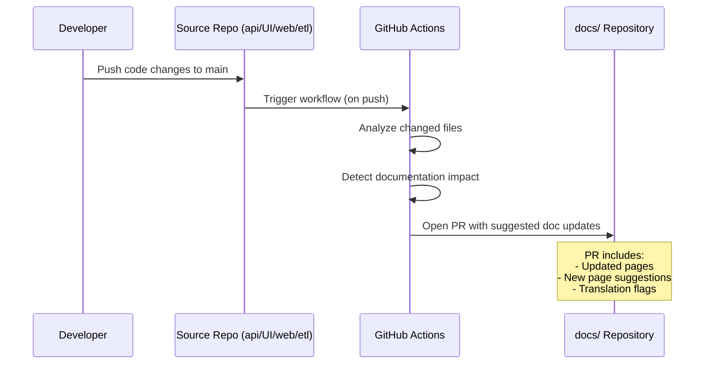

# Auto-Documentation

The auto-documentation system uses GitHub Actions to detect when code changes and documentation might be out of sync, then opens pull requests to update the docs.

## How It Works



## Architecture

The system has two components:

### 1. Source Repository Workflow

Each source repository (`api/`, `UI/`, `web/`, `etl/`) has a GitHub Actions workflow that:

1. Triggers on push to `main`
2. Analyzes which files changed
3. Maps file changes to documentation sections
4. Sends a `repository_dispatch` event to the docs repository

### 2. Docs Repository Workflow

The docs repository receives dispatch events and:

1. Reads the change payload (which files, which sections)
2. Checks if the referenced documentation pages exist and are current
3. Flags pages that may need updates
4. Opens a PR with:
   - A checklist of pages to review
   - Suggested content updates (if deterministic)
   - Translation impact notes (which locales need updates)

## Change-to-Docs Mapping

The system maps source code paths to documentation sections:

### API Repository

| File Path Pattern | Documentation Section |
|---|---|
| `src/handlers/auth.rs` | `backend/authentication`, `backend/endpoints/auth` |
| `src/handlers/recipe.rs` | `backend/endpoints/recipes` |
| `src/handlers/meal_plan.rs` | `backend/endpoints/meal-plans` |
| `src/entity/*.rs` | `backend/database` |
| `src/services/*.rs` | `backend/` (relevant endpoint page) |
| `Cargo.toml` | `architecture/repositories` |
| `docker-compose.yml` | `backend/getting-started` |

### UI Repository

| File Path Pattern | Documentation Section |
|---|---|
| `lib/src/features/auth/` | `mobile/screens` (auth section) |
| `lib/src/features/recipes/` | `mobile/screens` (recipes section) |
| `lib/src/shared/theme/` | `mobile/theme` |
| `lib/src/core/api/` | `mobile/api-integration` |
| `pubspec.yaml` | `architecture/repositories` |

### ETL Repository

| File Path Pattern | Documentation Section |
|---|---|
| `main.py` | `etl/overview` |
| `requirements.txt` | `architecture/repositories` |

## Source Repository Workflow

Add this workflow to each source repository (`.github/workflows/notify-docs.yml`):

```yaml
name: Notify Documentation

on:
  push:
    branches: [main]

jobs:
  notify-docs:
    runs-on: ubuntu-latest
    steps:
      - uses: actions/checkout@v4
        with:
          fetch-depth: 2

      - name: Detect changed files
        id: changes
        run: |
          echo "files=$(git diff --name-only HEAD~1 HEAD | jq -R -s -c 'split("\n") | map(select(. != ""))')" >> $GITHUB_OUTPUT

      - name: Dispatch to docs
        uses: peter-evans/repository-dispatch@v3
        with:
          token: ${{ secrets.DOCS_DISPATCH_TOKEN }}
          repository: Cookest/docs
          event-type: code-change
          client-payload: |
            {
              "repo": "${{ github.repository }}",
              "ref": "${{ github.sha }}",
              "files": ${{ steps.changes.outputs.files }},
              "commit_message": "${{ github.event.head_commit.message }}",
              "author": "${{ github.event.head_commit.author.name }}"
            }
```

## Docs Repository Workflow

The docs repository receives these events (`.github/workflows/auto-docs.yml`):

```yaml
name: Auto-Documentation

on:
  repository_dispatch:
    types: [code-change]
  workflow_dispatch:
    inputs:
      repo:
        description: 'Repository that changed (e.g., Cookest/api)'
        required: true
      files:
        description: 'JSON array of changed file paths'
        required: true

jobs:
  analyze-and-pr:
    runs-on: ubuntu-latest
    steps:
      - uses: actions/checkout@v4

      - name: Analyze documentation impact
        id: analyze
        run: |
          # Map changed files to documentation sections
          # This script reads the mapping config and outputs affected pages
          node scripts/analyze-docs-impact.js \
            --repo '${{ github.event.client_payload.repo || github.event.inputs.repo }}' \
            --files '${{ github.event.client_payload.files || github.event.inputs.files }}'

      - name: Create documentation update PR
        if: steps.analyze.outputs.has_impact == 'true'
        uses: peter-evans/create-pull-request@v7
        with:
          token: ${{ secrets.GITHUB_TOKEN }}
          commit-message: "docs: flag pages needing review after code change"
          title: "docs: review needed — changes in ${{ github.event.client_payload.repo || github.event.inputs.repo }}"
          body: |
            ## Auto-Documentation Review

            Code changes in `${{ github.event.client_payload.repo || github.event.inputs.repo }}` may affect these documentation pages:

            ${{ steps.analyze.outputs.affected_pages }}

            ### Action Required
            - [ ] Review each flagged page for accuracy
            - [ ] Update content if needed
            - [ ] Update translations for changed pages

            ---
            *This PR was automatically created by the auto-documentation system.*
            *Commit: ${{ github.event.client_payload.ref }}*
            *Author: ${{ github.event.client_payload.author }}*
          branch: auto-docs/${{ github.run_id }}
          labels: documentation,auto-generated
```

## Translation Impact

When a documentation page is updated, the system also flags translation impact:

- **Tier 1 locales (EN, PT):** PR includes a checklist item for Portuguese translation update
- **Tier 2 locales (FR, DE, ES):** Noted in PR body but not blocking

## Manual Trigger

The workflow supports manual dispatch for ad-hoc documentation reviews:

1. Go to the docs repository → Actions → Auto-Documentation
2. Click "Run workflow"
3. Enter the repository and changed files
4. The workflow creates a review PR

## Setup Requirements

### Secrets

| Secret | Repository | Description |
|--------|-----------|-------------|
| `DOCS_DISPATCH_TOKEN` | Source repos (api, UI, web, etl) | Personal access token with `repo` scope for dispatching to docs repo |

### Permissions

The docs repository must allow:
- GitHub Actions to create pull requests
- Repository dispatch events from source repositories

## Extending the Mapping

To add new file-to-docs mappings, update `docs/scripts/docs-mapping.json`:

```json
{
  "Cookest/api": {
    "src/handlers/new_feature.rs": ["backend/endpoints/new-feature"],
    "src/services/new_feature.rs": ["backend/endpoints/new-feature"]
  }
}
```
