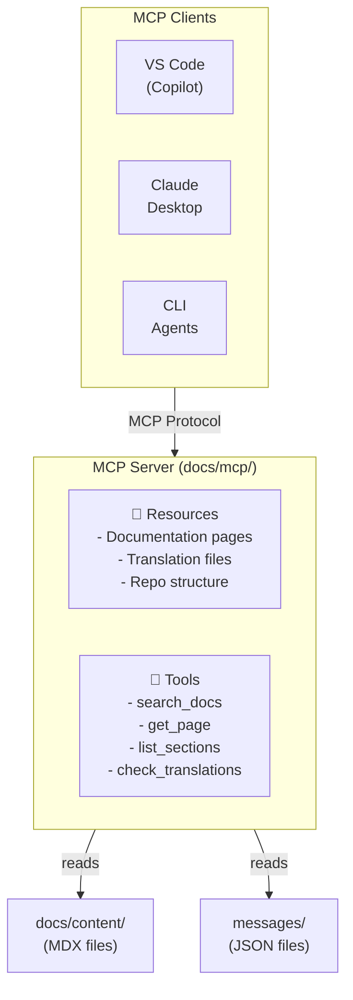

# MCP Server

The Cookest MCP (Model Context Protocol) server provides programmatic access to the documentation, enabling AI agents to search, read, and understand the Cookest ecosystem without manual file browsing.

## What is MCP?

[Model Context Protocol](https://modelcontextprotocol.io/) is an open standard for connecting AI models to external data sources and tools. An MCP server exposes **resources** (data to read) and **tools** (actions to perform) that AI agents can use.

## Architecture



## Setup

### Prerequisites

- Node.js 20+ or Bun 1.x
- The docs repository cloned locally

### Installation

```bash
cd docs/mcp
npm install
```

### Configuration

Create `docs/mcp/.env`:

```bash
DOCS_ROOT=../content/docs
MESSAGES_ROOT=../messages
PORT=3100
```

### Running

```bash
# Development
cd docs/mcp
npm run dev

# Production
npm run build && npm start
```

## Available Resources

MCP resources are read-only data that agents can access.

### `docs://pages`

Lists all documentation pages with metadata.

```json
{
  "uri": "docs://pages",
  "name": "Documentation Pages",
  "description": "List of all documentation pages across all locales",
  "mimeType": "application/json"
}
```

### `docs://page/{locale}/{path}`

Returns the content of a specific documentation page.

```json
{
  "uri": "docs://page/en/backend/getting-started",
  "name": "Backend Getting Started (EN)",
  "mimeType": "text/markdown"
}
```

### `docs://translations/{locale}`

Returns the UI translation strings for a locale.

```json
{
  "uri": "docs://translations/pt",
  "name": "Portuguese Translations",
  "mimeType": "application/json"
}
```

### `docs://structure`

Returns the repository structure map.

```json
{
  "uri": "docs://structure",
  "name": "Cookest Repository Structure",
  "description": "Map of all repositories, their purpose, and tech stack",
  "mimeType": "application/json"
}
```

## Available Tools

MCP tools are actions that agents can invoke.

### `search_docs`

Full-text search across all documentation pages.

**Parameters:**
| Name | Type | Required | Description |
|------|------|----------|-------------|
| `query` | string | ✅ | Search query |
| `locale` | string | ❌ | Filter by locale (default: all) |
| `section` | string | ❌ | Filter by section (backend, mobile, etc.) |
| `limit` | number | ❌ | Max results (default: 10) |

**Example:**
```json
{
  "name": "search_docs",
  "arguments": {
    "query": "JWT authentication refresh token",
    "locale": "en",
    "limit": 5
  }
}
```

### `get_page`

Retrieve a specific documentation page by path.

**Parameters:**
| Name | Type | Required | Description |
|------|------|----------|-------------|
| `path` | string | ✅ | Page path (e.g., "backend/authentication") |
| `locale` | string | ❌ | Locale (default: "en") |

### `list_sections`

List all documentation sections and their pages.

**Parameters:**
| Name | Type | Required | Description |
|------|------|----------|-------------|
| `locale` | string | ❌ | Locale (default: "en") |

### `check_translations`

Check translation coverage for a locale.

**Parameters:**
| Name | Type | Required | Description |
|------|------|----------|-------------|
| `locale` | string | ✅ | Target locale to check |

**Returns:**
```json
{
  "locale": "fr",
  "tier": 2,
  "coverage": {
    "pages": { "total": 32, "translated": 1, "percentage": 3.1 },
    "uiStrings": { "total": 24, "translated": 24, "percentage": 100 }
  },
  "missingPages": [
    "backend/getting-started",
    "backend/authentication",
    "mobile/overview"
  ]
}
```

## Client Configuration

### VS Code (GitHub Copilot)

Add to your `.vscode/settings.json`:

```json
{
  "github.copilot.chat.mcpServers": {
    "cookest-docs": {
      "command": "node",
      "args": ["docs/mcp/dist/index.js"],
      "env": {
        "DOCS_ROOT": "${workspaceFolder}/docs/content/docs",
        "MESSAGES_ROOT": "${workspaceFolder}/docs/messages"
      }
    }
  }
}
```

### Claude Desktop

Add to your `claude_desktop_config.json`:

```json
{
  "mcpServers": {
    "cookest-docs": {
      "command": "node",
      "args": ["/path/to/docs/mcp/dist/index.js"],
      "env": {
        "DOCS_ROOT": "/path/to/docs/content/docs",
        "MESSAGES_ROOT": "/path/to/docs/messages"
      }
    }
  }
}
```

## Implementation

The MCP server is implemented in TypeScript using the `@modelcontextprotocol/sdk` package. Source code lives in `docs/mcp/`.

```
docs/mcp/
├── package.json
├── tsconfig.json
├── src/
│   ├── index.ts          ← Server entry point
│   ├── resources.ts      ← Resource handlers
│   ├── tools.ts          ← Tool handlers
│   └── utils.ts          ← File reading, search, parsing
└── dist/                 ← Compiled output
```

### Contributing

When extending the MCP server:
1. Add new tools/resources in the appropriate handler file
2. Update this documentation page
3. Test with at least one MCP client
4. Follow the TypeScript conventions in [Best Practices](/docs/contributing/best-practices)
