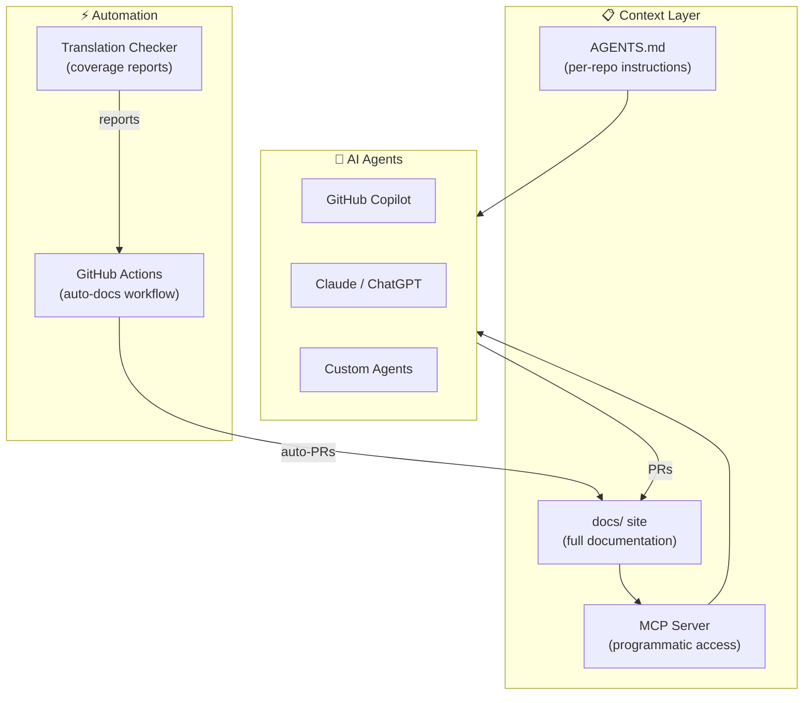

# AI & Automation

Cookest embraces AI-assisted development as a first-class concern. This section documents how AI agents work with the codebase, what tools and context they have, and how automation keeps documentation synchronized with code.

## Philosophy

1. **AI is a contributor, not a replacement.** AI agents follow the same standards as human contributors — same commit format, same PR process, same quality bar
2. **Context is everything.** Agents work best with explicit, structured context. Every repo provides an `AGENTS.md` that tells agents what they need to know
3. **Documentation drives development.** The docs site is the single source of truth. Agents read it before making changes and update it after
4. **Automation reduces drift.** GitHub Actions detect when code and documentation diverge and open PRs to fix it

## Components

## What's in This Section

| Page | Description |
|------|-------------|
| [Agentic Skills](/docs/ai/skills) | Full deck of skills, capabilities, and patterns for AI agents working on Cookest |
| [Agent Instructions](/docs/ai/instructions) | Detailed instructions each agent receives when working on any Cookest repo |
| [MCP Server](/docs/ai/mcp-server) | Model Context Protocol server that provides documentation context to AI tools |
| [Auto-Documentation](/docs/ai/auto-docs) | GitHub Actions workflow that keeps docs synchronized with code changes |
