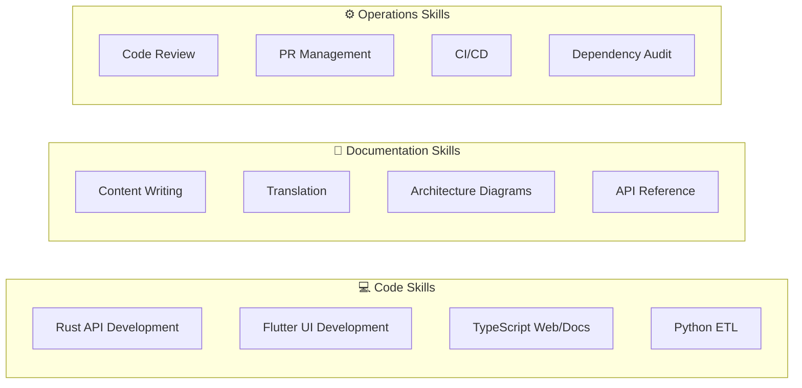

# Agentic Skills

This page defines the complete set of skills an AI agent should have when working on Cookest. Each skill includes its purpose, when to apply it, and how to execute it correctly.

## Skill Categories



---

## Code Skills

### SK-01: Rust API Development

**When:** Creating or modifying API endpoints, services, or data models.

**Context required:**
- Read `api/README.md` for endpoint overview
- Read `api/docs/database/SCHEMA.md` for database schema
- Read existing handlers/services in the same domain

**Patterns:**
```
Handler (thin) → Service (logic) → Entity (data)
```

**Checklist:**
- [ ] Handler validates input using `validation/` rules
- [ ] Service contains all business logic
- [ ] Entity uses SeaORM with `#[derive(Clone, Debug, DeriveEntityModel)]`
- [ ] Errors use `AppError` from `errors.rs`
- [ ] Auth middleware applied if endpoint needs authentication
- [ ] Rate limiting configured via governor
- [ ] Subscription tier checked if feature is gated
- [ ] Tests cover happy path + error cases

### SK-02: Flutter UI Development

**When:** Creating or modifying screens, widgets, or state management.

**Context required:**
- Read `UI/lib/src/shared/theme/` for color/typography constants
- Read existing feature modules for patterns
- Check Riverpod providers in the same feature

**Patterns:**
```
Screen → Provider (Riverpod) → Repository → API Client (Dio)
```

**Checklist:**
- [ ] Use `const` constructors wherever possible
- [ ] Follow Material 3 theming with sage green (#7A9A65)
- [ ] Riverpod provider per data concern
- [ ] GoRouter for navigation (no manual `Navigator.push`)
- [ ] Responsive layout considerations
- [ ] Dark mode support via theme tokens
- [ ] Error states handled in UI

### SK-03: TypeScript Web/Docs Development

**When:** Modifying the landing page or documentation site.

**Context required:**
- Web: Read `web/app/components/` for existing patterns
- Docs: Read `docs/lib/i18n.ts` for locale system
- Read `messages/*.json` for translation keys

**Checklist:**
- [ ] Components use TypeScript strict mode
- [ ] Translations use `t(locale, key)` — no hardcoded strings
- [ ] TailwindCSS for styling
- [ ] Responsive design (mobile-first)
- [ ] Dark mode via theme provider
- [ ] Framer Motion for animations (web only)

### SK-04: Python ETL Development

**When:** Modifying data ingestion pipelines.

**Context required:**
- Read `etl/README.md` for pipeline overview
- Check `api/docs/database/SCHEMA.md` for target schema
- Understand rate limiting configuration

**Checklist:**
- [ ] Upsert logic (ON CONFLICT) for idempotency
- [ ] Rate limiting respected for external APIs
- [ ] Progress bars via tqdm
- [ ] Error handling with logging (not print)
- [ ] Type hints on all functions

---

## Documentation Skills

### SK-05: Content Writing

**When:** Writing new documentation pages or updating existing ones.

**Context required:**
- Read `docs/content/docs/contributing/guide.mdx` for standards
- Read existing pages in the same section for voice consistency
- Check source code for accuracy

**Checklist:**
- [ ] Frontmatter with `title` and `description`
- [ ] H1 matches frontmatter title
- [ ] Max H3 depth (never H4+)
- [ ] Code blocks have language tags
- [ ] Tables for structured data
- [ ] Mermaid for diagrams
- [ ] Callouts for warnings/notes
- [ ] Added to section's `meta.json`

### SK-06: Translation

**When:** Translating documentation to a new language or updating existing translations.

**Context required:**
- Read `docs/content/docs/contributing/translations.mdx`
- Read `messages/en.json` for UI string structure
- Check language-specific style guide

**Checklist:**
- [ ] All prose translated, code blocks kept in English
- [ ] Frontmatter translated
- [ ] `meta.json` updated for the locale
- [ ] JSON message file updated if UI strings changed
- [ ] Community translation banner added (Tier 2 languages)
- [ ] Technical terms kept in English (JWT, API, webhook)

### SK-07: Architecture Diagrams

**When:** Documenting system design, data flows, or component relationships.

**Tool:** Mermaid (rendered natively by Fumadocs).

**Diagram types:**
| Type | Use Case |
|------|----------|
| `graph TD` | Component architecture, data flow |
| `sequenceDiagram` | Auth flows, request/response |
| `erDiagram` | Database schema |
| `flowchart` | Decision trees, pipelines |

### SK-08: API Reference Documentation

**When:** Documenting new or changed API endpoints.

**Structure per endpoint:**

```markdown
## Endpoint Name

| Method | Path | Auth | Tier |
|--------|------|------|------|
| POST | `/api/v1/resource` | Bearer | Pro |

### Request Body
{code block with JSON example}

### Response
{code block with JSON example}

### Error Codes
{table of possible errors}
```

---

## Operations Skills

### SK-09: Code Review

**When:** Reviewing PRs from human or AI contributors.

**Focus areas:**
1. **Correctness** — Does the code do what it claims?
2. **Security** — No secrets, proper auth, input validation
3. **Performance** — No N+1 queries, appropriate indexing
4. **Consistency** — Follows project conventions
5. **Documentation** — Changes reflected in docs

### SK-10: PR Management

**When:** Creating, updating, or merging pull requests.

**Commit conventions:**
```
<type>(<scope>): <description>
```

**PR title:** Same format as commit messages.

**PR body:** Must include What, Why, How, Testing sections.

### SK-11: CI/CD Pipeline

**When:** Adding or modifying automated workflows.

**Available pipelines:**
- `auto-docs.yml` — Detects code changes, suggests doc updates
- `translation-check.yml` — Reports translation coverage

### SK-12: Dependency Audit

**When:** Reviewing or updating project dependencies.

**Per-language tools:**
| Language | Audit Command |
|----------|---------------|
| Rust | `cargo audit` |
| Dart | `flutter pub outdated` |
| Node.js | `npm audit` |
| Python | `pip-audit` |

---

## Skill Application Matrix

| Skill | api | UI | web | docs | etl |
|-------|:---:|:--:|:---:|:----:|:---:|
| SK-01 Rust API | ✅ | | | | |
| SK-02 Flutter UI | | ✅ | | | |
| SK-03 TypeScript | | | ✅ | ✅ | |
| SK-04 Python ETL | | | | | ✅ |
| SK-05 Content Writing | | | | ✅ | |
| SK-06 Translation | | | ✅ | ✅ | |
| SK-07 Diagrams | | | | ✅ | |
| SK-08 API Reference | ✅ | | | ✅ | |
| SK-09 Code Review | ✅ | ✅ | ✅ | ✅ | ✅ |
| SK-10 PR Management | ✅ | ✅ | ✅ | ✅ | ✅ |
| SK-11 CI/CD | ✅ | ✅ | ✅ | ✅ | ✅ |
| SK-12 Dependency Audit | ✅ | ✅ | ✅ | ✅ | ✅ |
