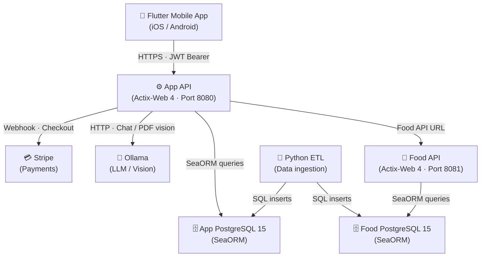

# Architecture Overview

Cookest is organized into four main pieces that communicate via HTTP.

## Component diagram

## Components

### Food API (`api/crates/food-api`)

The standalone catalog service. Built with **Actix-Web 4** for high-throughput async handling. Key responsibilities:
- ingredient search and detail
- recipe catalog CRUD for API-key clients
- nutrition, portions, and allergen data

### App API (`api/crates/app-api`)

The authenticated product backend. Key responsibilities:
- JWT-based authentication with access + refresh token pair
- recipe browsing, favouriting, rating, and cook tracking
- weekly meal plan generation
- pantry/inventory tracking with expiry alerts
- shopping list with optional price comparison
- AI chat via Ollama
- Stripe subscription with webhook idempotency

### Flutter Mobile App (`UI/`)

A cross-platform iOS/Android client with a custom design system inspired by ShadCN's restraint. Key characteristics:
- **Riverpod** for all state management
- **GoRouter** with a 5-tab shell route
- Playfair Display + Inter typography
- Sage green (`#7A9A65`) brand colour throughout
- All API calls go through repository classes using Dio

### Python ETL (`etl/`)

A data ingestion pipeline that processes external food and nutritional data and seeds the PostgreSQL databases used by the backend.

## Key design decisions

### Subscription tier in JWT

The user's subscription tier (`free` / `pro` / `family`) is embedded in every access token. This means API middleware can gate Pro features without a database round-trip on every request. The tier is re-read from the database each time the token is refreshed (15-minute TTL).

### Online preference learning

`PreferenceService` applies incremental gradient-descent updates (learning rate 0.01) to per-user cuisine/ingredient/difficulty weight vectors every time a user rates or completes a recipe. Over time, meal plan generation becomes increasingly personalized.

### Idempotent migrations

All schema changes use `CREATE TABLE IF NOT EXISTS` and `ALTER TABLE ... ADD COLUMN IF NOT EXISTS`. Migrations run automatically on every server start — safe for all deployment scenarios.

### SHA-256 refresh tokens

Refresh tokens are stored in the database as `sha256(raw_token)`. The raw token is only ever held by the client in an httpOnly cookie. Even a full database dump cannot be used to forge valid sessions.

### Admin endpoints — DB, not JWT

Admin-only routes always verify `is_admin = true` by querying the database, regardless of what the JWT claims contain.
