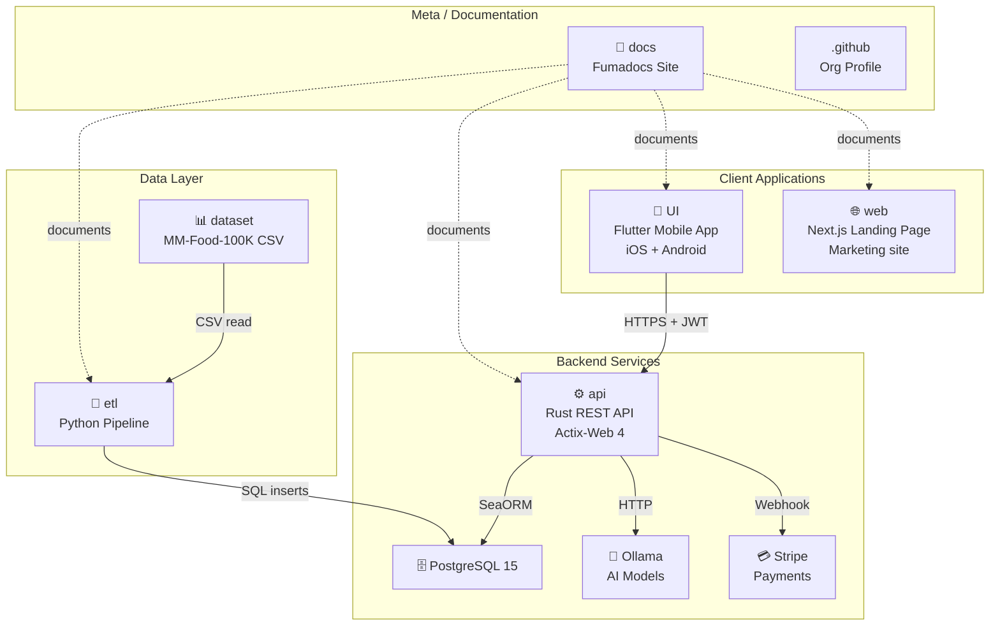
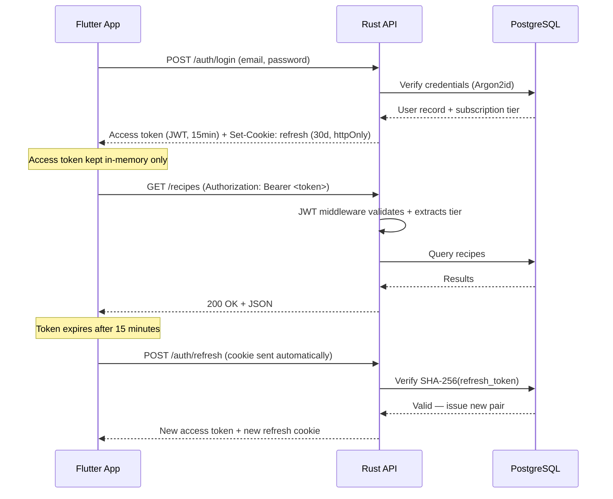
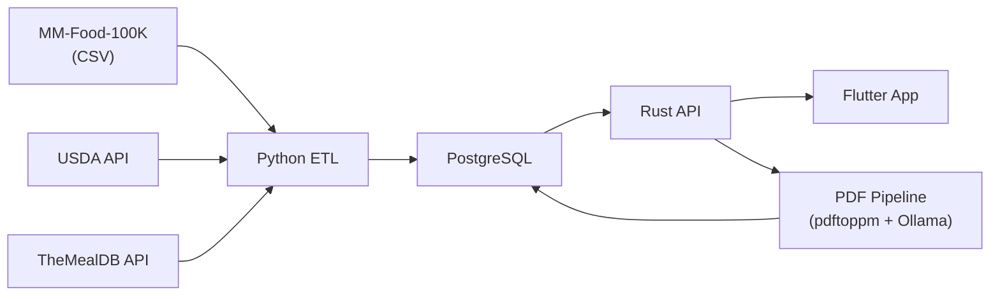

# Repository Guide

Cookest is a multi-repository project. Each repository is an independent component with its own Git history, CI/CD, and deployment. This page documents what each repo does and how they connect.

## Ecosystem Map



## Repository Details

### `api/` — Rust Backend API

| Attribute | Value |
|-----------|-------|
| **Language** | Rust 1.78+ |
| **Framework** | Actix-Web 4 |
| **ORM** | SeaORM 1.1 |
| **Database** | PostgreSQL 15+ |
| **Auth** | Argon2id + JWT (access + refresh) |
| **AI** | Ollama (llava vision + chat) |
| **Payments** | Stripe webhooks |

**Purpose:** Core backend serving authentication, recipes, inventory, meal planning, AI chat, subscription management, and PDF price-scraping for supermarket promotions.

**Key directories:**
```
api/src/
├── entity/        ← 20+ SeaORM data models
├── handlers/      ← HTTP request handlers (one per domain)
├── services/      ← Business logic (17 service files)
├── middleware/     ← JWT auth + rate limiting
├── models/        ← DTOs and request/response types
└── validation/    ← Request validation rules
```

**Quick start:**
```bash
cd api
cp .env.example .env           # Configure DATABASE_URL, JWT_SECRET, etc.
docker compose up -d            # Start PostgreSQL
cargo run                       # Start API on port 8080
```

---

### `UI/` — Flutter Mobile App

| Attribute | Value |
|-----------|-------|
| **Language** | Dart 3.x |
| **Framework** | Flutter 3.x |
| **State** | Riverpod 2.5 |
| **Navigation** | GoRouter 17 |
| **HTTP** | Dio 5.9 + cookie manager |
| **Design** | Material 3, sage green (#7A9A65) |

**Purpose:** Native iOS/Android client for meal planning, shopping, pantry management, and AI chat.

**Key directories:**
```
UI/lib/src/
├── core/          ← API client, auth, storage
├── features/      ← Feature modules (auth, recipes, meal_plan, etc.)
└── shared/        ← Reusable widgets, theme, components
```

**Quick start:**
```bash
cd UI
flutter pub get
flutter run                     # Run on connected device/emulator
```

---

### `web/` — Next.js Landing Page

| Attribute | Value |
|-----------|-------|
| **Language** | TypeScript 5 |
| **Framework** | Next.js 16 (App Router) |
| **Styling** | TailwindCSS 4 |
| **Animations** | Framer Motion 12 |
| **i18n** | Custom TranslationProvider (5 languages) |

**Purpose:** Public-facing marketing site showcasing Cookest features, app download links, and sustainability mission.

**Key components:**
```
web/app/components/
├── Nav.tsx, Hero.tsx, Features.tsx
├── Showcase.tsx, HowItWorks.tsx
├── Sustainability.tsx, Download.tsx
├── TranslationProvider.tsx      ← i18n context
└── ShaderCanvas.tsx             ← WebGL effects
```

**Quick start:**
```bash
cd web
npm install
npm run dev                     # Start on localhost:3000
```

---

### `etl/` — Python Data Pipeline

| Attribute | Value |
|-----------|-------|
| **Language** | Python 3.10+ |
| **Database** | psycopg2 → PostgreSQL |
| **APIs** | USDA FoodData Central, TheMealDB |
| **Data** | MM-Food-100K (~100K recipes) |

**Purpose:** Extract, transform, and load recipe + nutrition data into the PostgreSQL database.

**Pipeline stages:**
1. **Extract** → Read CSV + API responses with rate limiting
2. **Transform** → Normalize ingredients, deduplicate, convert units, enrich nutrition
3. **Load** → Bulk upsert into PostgreSQL (idempotent)

**Quick start:**
```bash
cd etl
python -m venv .venv && source .venv/bin/activate
pip install -r requirements.txt
cp .env.example .env            # Set DATABASE_URL, USDA_API_KEY
python main.py
```

---

### `dataset/` — Recipe Data

Contains `MM-Food-100K.csv` — approximately 100,000 recipe records with:
- Recipe name, cuisine, cooking method
- Ingredient lists (JSON)
- Nutritional profiles (calories, fat, protein, carbs)
- Portion sizes with gram equivalents
- Image URLs

This CSV is consumed by the ETL pipeline.

---

### `docs/` — Documentation Site

| Attribute | Value |
|-----------|-------|
| **Framework** | Next.js 16 + Fumadocs 16.8 |
| **Content** | MDX files (Markdown + JSX) |
| **Languages** | EN, PT (Tier 1) + FR, DE, ES (Tier 2) |
| **Runtime** | Bun |

**Purpose:** Centralized documentation for the entire ecosystem. You're reading it now.

See [Documentation Architecture](/docs/contributing/docs-architecture) for technical details.

---

### `.github/` — Organization Profile

Contains the GitHub organization profile README and assets displayed on the Cookest GitHub organization page. Separate Git repository.

## How Components Connect

### Authentication Flow



### Data Flow



### Subscription Tiers

| Feature | Free | Pro (€9.99/mo) | Family (€14.99/mo) |
|---------|:----:|:--------------:|:-------------------:|
| Inventory + meal plan | ✅ | ✅ | ✅ |
| AI meal plan generation | ❌ | ✅ | ✅ |
| AI Chat | 10/day | ∞ | ∞ |
| Price comparison | ❌ | ✅ | ✅ |
| User-created recipes | ❌ | ✅ | ✅ |
| Shopping list optimizer | ❌ | ✅ | ✅ |
| Multiple household profiles | ❌ | ❌ | ✅ |
