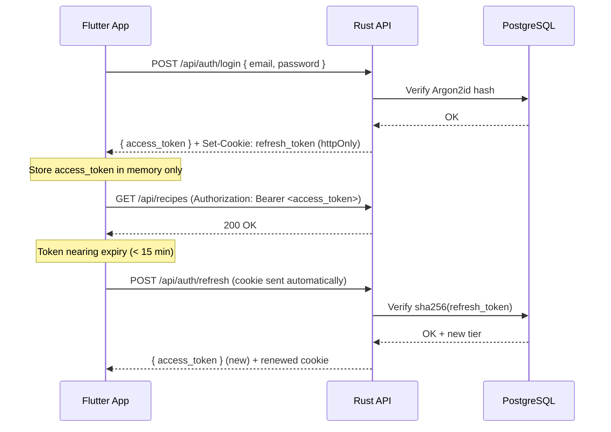

# Authentication

The App API uses a **JWT access + refresh token pair**. Access tokens are short-lived (15 min); refresh tokens are long-lived (30 days) and stored server-side as `sha256(token)`.

## Flow



## Bearer token

All protected endpoints require:

```
Authorization: Bearer <access_token>
```

## Token claims

```json
{
  "sub": "uuid-of-user",
  "email": "user@example.com",
  "exp": 1234567890,
  "iat": 1234567800,
  "jti": "unique-token-id",
  "tier": "pro",
  "is_admin": false,
  "token_type": "access"
}
```

The `tier` claim allows client-side feature gating without an extra API call:

```dart
final payload = JwtDecoder.decode(accessToken);
final tier = payload['tier'] as String; // "free" | "pro" | "family"
if (tier == 'free') showUpgradePrompt();
```

## Registration

```bash
POST /api/auth/register
Content-Type: application/json

{
  "email": "user@example.com",
  "password": "securepassword",
  "name": "Alice"
}
```

Response: `201 Created` — user created but not yet onboarded.

## Login

```bash
POST /api/auth/login
Content-Type: application/json

{
  "email": "user@example.com",
  "password": "securepassword"
}
```

Response:
```json
{
  "access_token": "eyJ...",
  "token_type": "Bearer",
  "expires_in": 900
}
```
The `refresh_token` is set as an httpOnly cookie automatically.

## Refresh

```bash
POST /api/auth/refresh
# Cookie: refresh_token=<token>  (sent automatically by browser/Dio)
```

Returns a new `access_token`. The refresh cookie is also renewed.

## Logout

```bash
POST /api/auth/logout
Authorization: Bearer <access_token>
```

Invalidates the refresh token in the database.

## Onboarding

After registration, complete the user profile:

```bash
POST /api/auth/onboarding
Authorization: Bearer <access_token>
Content-Type: application/json

{
  "household_size": 2,
  "dietary_restrictions": ["vegetarian"],
  "allergies": ["nuts"],
  "health_goals": ["weight_loss"],
  "cooking_skill": "intermediate"
}
```

## Security model

| Concern | Solution |
|---------|----------|
| Password storage | Argon2id (memory-hard) |
| Refresh token storage | SHA-256 hash only — raw token never persisted |
| Access token storage | Client memory only — never `localStorage` |
| Refresh token transport | httpOnly cookie — inaccessible to JS |
| Admin verification | Always re-verified from DB — JWT claim not trusted alone |
| Rate limiting | `governor` middleware on all endpoints |
