# Database Schema

The Cookest API uses **PostgreSQL 15+** accessed via **SeaORM 1.1**. Migrations run automatically at server startup — all operations use `IF NOT EXISTS` making them safe to replay.

## ER Diagram

```mermaid
erDiagram
    users ||--|| user_preferences : has
    users ||--o{ inventory_items : owns
    users ||--o{ meal_plans : creates
    users ||--o{ user_favorites : saves
    users ||--o{ recipe_ratings : rates
    users ||--o{ cooking_history : cooks
    users ||--o{ chat_sessions : starts
    users ||--o{ shopping_list_items : lists
    users ||--o{ user_push_tokens : registers

    ingredients ||--|| ingredient_nutrients : nutrition
    ingredients ||--o{ portion_sizes : portions
    ingredients ||--o{ recipe_ingredients : used_in
    ingredients ||--o{ inventory_items : tracked_as
    ingredients ||--o{ store_promotion_ingredients : matched

    recipes ||--o{ recipe_ingredients : contains
    recipes ||--o{ recipe_steps : has
    recipes ||--o{ recipe_images : has
    recipes ||--|| recipe_nutrition : nutrition
    recipes ||--o{ user_favorites : favorited
    recipes ||--o{ recipe_ratings : rated
    recipes ||--o{ cooking_history : cooked
    recipes ||--o{ meal_plan_slots : planned

    meal_plans ||--o{ meal_plan_slots : includes

    chat_sessions ||--o{ chat_messages : contains

    stores ||--o{ pdf_processing_jobs : processes
    stores ||--o{ store_promotions : publishes
    stores ||--o{ store_promotion_candidates : stages

    store_promotions ||--o{ store_promotion_ingredients : links
```



---

## Identity & preferences

### users

Account credentials, profile, onboarding data, and subscription status.

| Column | Type | Notes |
|--------|------|-------|
| `id` | `UUID` PK | Auto-generated v4 |
| `email` | `VARCHAR(255)` UNIQUE | Login identifier |
| `name` | `VARCHAR(255)` | Display name |
| `password_hash` | `TEXT` | bcrypt hash |
| `refresh_token_hash` | `TEXT` | SHA-256 of raw refresh token |
| `household_size` | `INTEGER` | Default `1` — scales recipe servings |
| `dietary_restrictions` | `TEXT[]` | e.g. `{vegetarian, gluten_free}` |
| `allergies` | `TEXT[]` | e.g. `{shellfish, eggs}` |
| `avatar_url` | `TEXT` | Profile picture URL |
| `subscription_tier` | `TEXT` | `free` / `pro` / `family` |
| `subscription_valid_until` | `TIMESTAMPTZ` | Null for free tier |
| `stripe_customer_id` | `TEXT` | Stripe customer reference |
| `cooking_skill_level` | `TEXT` | `beginner` / `intermediate` / `advanced` |
| `preferred_cuisines` | `TEXT[]` | Onboarding selections |
| `health_goals` | `TEXT[]` | e.g. `{weight_loss, muscle_gain}` |
| `weekly_budget` | `NUMERIC(10,2)` | Optional budget cap |
| `preferred_time_per_meal_min` | `INTEGER` | Max cook time preference |
| `onboarding_completed` | `BOOLEAN` | Default `false` |
| `is_admin` | `BOOLEAN` | Checked via DB, never JWT |
| `is_email_verified` | `BOOLEAN` | Email verification status |
| `two_factor_enabled` | `BOOLEAN` | TOTP 2FA toggle |
| `totp_secret` | `TEXT` | Encrypted TOTP seed |
| `failed_login_attempts` | `INTEGER` | Reset on successful login |
| `locked_until` | `TIMESTAMPTZ` | Account lockout expiry |
| `created_at` | `TIMESTAMPTZ` | |
| `updated_at` | `TIMESTAMPTZ` | |

### user_preferences

Per-user AI preference vectors updated incrementally via online gradient descent (learning rate 0.01).

| Column | Type | Notes |
|--------|------|-------|
| `user_id` | `UUID` PK, FK → users | One-to-one with users |
| `cuisine_weights` | `JSONB` | e.g. `{"italian": 0.8, "japanese": 0.3}` |
| `ingredient_weights` | `JSONB` | Per-ingredient affinity scores |
| `macro_bias` | `JSONB` | `{"protein": 0.0, "carbs": 0.0, "fat": 0.0}` |
| `difficulty_weights` | `JSONB` | `{"easy": 0.0, "medium": 0.0, "hard": 0.0}` |
| `preferred_time_min` | `INTEGER` | Default `30` |
| `interaction_count` | `INTEGER` | Total ratings + cooks |
| `updated_at` | `TIMESTAMPTZ` | |

---

## Ingredients & nutrition

### ingredients

Master ingredient catalog seeded by the ETL pipeline from FoodData Central and Open Food Facts.

| Column | Type | Notes |
|--------|------|-------|
| `id` | `BIGSERIAL` PK | |
| `name` | `TEXT` UNIQUE | Canonical name |
| `category` | `TEXT` | e.g. `dairy`, `vegetable` |
| `fdc_id` | `INTEGER` | FoodData Central ID (indexed) |
| `off_id` | `TEXT` | Open Food Facts ID |
| `created_at` | `TIMESTAMPTZ` | |

### ingredient_nutrients

Detailed macro and micronutrient values per 100 g of ingredient. One-to-one with ingredients.

| Column | Type | Notes |
|--------|------|-------|
| `id` | `BIGSERIAL` PK | |
| `ingredient_id` | `BIGINT` FK → ingredients | UNIQUE — one row per ingredient |
| `calories` | `NUMERIC(10,4)` | kcal per 100 g |
| `protein_g` | `NUMERIC(10,4)` | |
| `carbs_g` | `NUMERIC(10,4)` | |
| `fat_g` | `NUMERIC(10,4)` | |
| `fiber_g` | `NUMERIC(10,4)` | |
| `sugar_g` | `NUMERIC(10,4)` | |
| `sodium_mg` | `NUMERIC(10,4)` | |
| `saturated_fat_g` | `NUMERIC(10,4)` | |
| `cholesterol_mg` | `NUMERIC(10,4)` | |
| `micronutrients` | `JSONB` | GIN-indexed for flexible queries |

### portion_sizes

Common serving sizes per ingredient (e.g. "1 medium egg = 50 g").

| Column | Type | Notes |
|--------|------|-------|
| `id` | `BIGSERIAL` PK | |
| `ingredient_id` | `BIGINT` FK → ingredients | |
| `description` | `TEXT` | e.g. "1 medium" |
| `weight_grams` | `NUMERIC(10,3)` | |
| `unit` | `TEXT` | e.g. "cup", "tbsp" |

---

## Recipes

### recipes

Recipe metadata. Supports dietary filters, full-text search (trigram GIN index on `name`), and per-user authorship.

| Column | Type | Notes |
|--------|------|-------|
| `id` | `BIGSERIAL` PK | |
| `name` | `TEXT` | Trigram GIN-indexed |
| `slug` | `TEXT` UNIQUE | URL-safe identifier |
| `description` | `TEXT` | |
| `cuisine` | `TEXT` | Indexed |
| `category` | `TEXT` | Indexed |
| `difficulty` | `TEXT` | Indexed — `easy` / `medium` / `hard` |
| `servings` | `INTEGER` | Default `2` |
| `prep_time_min` | `INTEGER` | |
| `cook_time_min` | `INTEGER` | |
| `total_time_min` | `INTEGER` | |
| `is_vegetarian` | `BOOLEAN` | Composite dietary index |
| `is_vegan` | `BOOLEAN` | |
| `is_gluten_free` | `BOOLEAN` | |
| `is_dairy_free` | `BOOLEAN` | |
| `is_nut_free` | `BOOLEAN` | |
| `source_url` | `TEXT` | Original recipe URL |
| `average_rating` | `NUMERIC(3,2)` | Denormalized average |
| `rating_count` | `INTEGER` | |
| `author_id` | `UUID` FK → users | Nullable — user-submitted recipes |
| `is_public` | `BOOLEAN` | Default `true` |
| `created_at` | `TIMESTAMPTZ` | |
| `updated_at` | `TIMESTAMPTZ` | |

### recipe_ingredients

Junction table bridging recipes ↔ ingredients with quantity and unit.

| Column | Type | Notes |
|--------|------|-------|
| `id` | `BIGSERIAL` PK | |
| `recipe_id` | `BIGINT` FK → recipes | ON DELETE CASCADE |
| `ingredient_id` | `BIGINT` FK → ingredients | ON DELETE RESTRICT |
| `quantity` | `NUMERIC(10,3)` | e.g. `200` |
| `unit` | `TEXT` | e.g. `g`, `ml`, `tbsp` |
| `quantity_grams` | `NUMERIC(10,3)` | Normalized weight for nutrition calc |
| `notes` | `TEXT` | e.g. "finely chopped" |
| `display_order` | `INTEGER` | Presentation sequence |

### recipe_steps

Ordered cooking instructions for a recipe.

| Column | Type | Notes |
|--------|------|-------|
| `id` | `BIGSERIAL` PK | |
| `recipe_id` | `BIGINT` FK → recipes | |
| `step_number` | `INTEGER` | UNIQUE per recipe |
| `instruction` | `TEXT` | Step text |
| `duration_min` | `INTEGER` | Optional time estimate |
| `image_url` | `TEXT` | Optional step photo |
| `tip` | `TEXT` | Optional cooking tip |

### recipe_images

Image URLs associated with recipes.

| Column | Type | Notes |
|--------|------|-------|
| `id` | `BIGSERIAL` PK | |
| `recipe_id` | `BIGINT` FK → recipes | |
| `url` | `TEXT` | Image URL |
| `image_type` | `TEXT` | e.g. `hero`, `step` |
| `is_primary` | `BOOLEAN` | Default `false` |
| `width` | `INTEGER` | |
| `height` | `INTEGER` | |
| `source` | `TEXT` | Attribution |
| `created_at` | `TIMESTAMPTZ` | |

### recipe_nutrition

Pre-calculated macro totals for a recipe. One-to-one with recipes.

| Column | Type | Notes |
|--------|------|-------|
| `id` | `BIGSERIAL` PK | |
| `recipe_id` | `BIGINT` FK → recipes | UNIQUE |
| `per_serving` | `BOOLEAN` | Default `true` — values are per-serving |
| `calories` | `NUMERIC(10,4)` | |
| `protein_g` | `NUMERIC(10,4)` | |
| `carbs_g` | `NUMERIC(10,4)` | |
| `fat_g` | `NUMERIC(10,4)` | |
| `fiber_g` | `NUMERIC(10,4)` | |
| `sugar_g` | `NUMERIC(10,4)` | |
| `sodium_mg` | `NUMERIC(10,4)` | |
| `saturated_fat_g` | `NUMERIC(10,4)` | |
| `cholesterol_mg` | `NUMERIC(10,4)` | |
| `micronutrients` | `JSONB` | |
| `calculated_at` | `TIMESTAMPTZ` | |

---

## User interactions

### user_favorites

Recipe saves/bookmarks per user.

| Column | Type | Notes |
|--------|------|-------|
| `id` | `BIGSERIAL` PK | |
| `user_id` | `UUID` FK → users | UNIQUE(user_id, recipe_id) |
| `recipe_id` | `BIGINT` FK → recipes | |
| `saved_at` | `TIMESTAMPTZ` | |

### recipe_ratings

1–5 star ratings with optional text comment.

| Column | Type | Notes |
|--------|------|-------|
| `id` | `BIGSERIAL` PK | |
| `user_id` | `UUID` FK → users | UNIQUE(user_id, recipe_id) |
| `recipe_id` | `BIGINT` FK → recipes | |
| `rating` | `SMALLINT` | CHECK 1–5 |
| `comment` | `TEXT` | |
| `created_at` | `TIMESTAMPTZ` | |
| `updated_at` | `TIMESTAMPTZ` | |

### cooking_history

Timestamped record of every time a user cooks a recipe. Triggers automatic inventory deduction.

| Column | Type | Notes |
|--------|------|-------|
| `id` | `BIGSERIAL` PK | |
| `user_id` | `UUID` FK → users | |
| `recipe_id` | `BIGINT` FK → recipes | |
| `servings_made` | `INTEGER` | Default `1` |
| `inventory_deducted` | `BOOLEAN` | Default `false` — set `true` after deduction |
| `cooked_at` | `TIMESTAMPTZ` | |

---

## Planning & inventory

### inventory_items

Pantry items with quantity, unit, expiry date, and storage location.

| Column | Type | Notes |
|--------|------|-------|
| `id` | `BIGSERIAL` PK | |
| `user_id` | `UUID` FK → users | |
| `ingredient_id` | `BIGINT` FK → ingredients | ON DELETE RESTRICT |
| `custom_name` | `TEXT` | Optional override display name |
| `quantity` | `NUMERIC(10,3)` | |
| `unit` | `TEXT` | e.g. `g`, `ml`, `units` |
| `expiry_date` | `DATE` | Indexed for expiry alerts |
| `storage_location` | `TEXT` | `fridge` / `freezer` / `pantry` / `other` |
| `added_at` | `TIMESTAMPTZ` | |
| `updated_at` | `TIMESTAMPTZ` | |

### meal_plans

Weekly plan container. One plan per user per week.

| Column | Type | Notes |
|--------|------|-------|
| `id` | `BIGSERIAL` PK | |
| `user_id` | `UUID` FK → users | UNIQUE(user_id, week_start) |
| `week_start` | `DATE` | Monday of the plan week |
| `is_ai_generated` | `BOOLEAN` | Default `false` |
| `created_at` | `TIMESTAMPTZ` | |
| `updated_at` | `TIMESTAMPTZ` | |

### meal_plan_slots

Individual meal assignments: day 0–6 × meal type. Supports flex/relief days.

| Column | Type | Notes |
|--------|------|-------|
| `id` | `BIGSERIAL` PK | |
| `meal_plan_id` | `BIGINT` FK → meal_plans | |
| `recipe_id` | `BIGINT` FK → recipes | Nullable — null for flex days |
| `day_of_week` | `SMALLINT` | CHECK 0–6 (Mon–Sun) |
| `meal_type` | `TEXT` | `breakfast` / `lunch` / `dinner` / `snack` |
| `servings_override` | `INTEGER` | Overrides recipe default |
| `is_completed` | `BOOLEAN` | Default `false` |
| `is_flex` | `BOOLEAN` | Default `false` — relief day flag |
| `flex_type` | `TEXT` | `effort` / `nutrition` / `mental` / `social` |
| `energy_level` | `TEXT` | Optional energy tracking |

<Callout type="info">
UNIQUE constraint on `(meal_plan_id, day_of_week, meal_type)` ensures at most one recipe per slot.
</Callout>

### shopping_list_items

User shopping list items, optionally linked to a meal plan for auto-sync.

| Column | Type | Notes |
|--------|------|-------|
| `id` | `UUID` PK | |
| `user_id` | `UUID` FK → users | |
| `ingredient_id` | `BIGINT` FK → ingredients | Nullable — for manual items |
| `name` | `TEXT` | Display name |
| `quantity` | `NUMERIC(10,3)` | |
| `unit` | `TEXT` | |
| `is_checked` | `BOOLEAN` | Default `false` |
| `is_manual` | `BOOLEAN` | `true` if added manually vs. synced |
| `meal_plan_id` | `BIGINT` FK → meal_plans | Nullable — links to source plan |
| `created_at` | `TIMESTAMPTZ` | |
| `updated_at` | `TIMESTAMPTZ` | |

---

## AI chat

### chat_sessions

One session per conversation thread, optionally scoped to a recipe (Cooking Mode chat).

| Column | Type | Notes |
|--------|------|-------|
| `id` | `BIGSERIAL` PK | |
| `user_id` | `UUID` FK → users | |
| `current_recipe_id` | `BIGINT` FK → recipes | Nullable — provides recipe context |
| `title` | `TEXT` | Auto-generated or user-set |
| `created_at` | `TIMESTAMPTZ` | |
| `updated_at` | `TIMESTAMPTZ` | |

### chat_messages

Individual messages within a chat session.

| Column | Type | Notes |
|--------|------|-------|
| `id` | `BIGSERIAL` PK | |
| `session_id` | `BIGINT` FK → chat_sessions | Indexed with `created_at` ASC |
| `role` | `TEXT` | CHECK `user` / `assistant` / `system` |
| `content` | `TEXT` | Message body |
| `tokens_used` | `INTEGER` | LLM token count for rate limiting |
| `created_at` | `TIMESTAMPTZ` | |

---

## Stores & promotions

### stores

Retail stores whose promotional flyers are processed by the PDF pipeline.

| Column | Type | Notes |
|--------|------|-------|
| `id` | `UUID` PK | |
| `name` | `TEXT` | Store name |
| `slug` | `TEXT` UNIQUE | URL-safe identifier |
| `website` | `TEXT` | |
| `logo_url` | `TEXT` | |
| `country` | `TEXT` | |
| `city` | `TEXT` | |
| `created_at` | `TIMESTAMPTZ` | |
| `updated_at` | `TIMESTAMPTZ` | |

### pdf_processing_jobs

Tracks the status of PDF flyer processing jobs.

| Column | Type | Notes |
|--------|------|-------|
| `id` | `UUID` PK | |
| `store_id` | `UUID` FK → stores | |
| `file_path` | `TEXT` | Path to uploaded PDF |
| `status` | `TEXT` | `pending` / `processing` / `completed` / `failed` |
| `error` | `TEXT` | Error message on failure |
| `retry_count` | `INTEGER` | Default `0` |
| `started_at` | `TIMESTAMPTZ` | |
| `heartbeat_at` | `TIMESTAMPTZ` | Liveness check for long jobs |
| `processed_at` | `TIMESTAMPTZ` | |
| `created_at` | `TIMESTAMPTZ` | |

### store_promotions

Live promotional prices extracted from processed PDFs and approved by admin.

| Column | Type | Notes |
|--------|------|-------|
| `id` | `UUID` PK | |
| `store_id` | `UUID` FK → stores | |
| `product_name` | `TEXT` | Raw product name from PDF |
| `brand` | `TEXT` | |
| `original_price` | `NUMERIC(10,2)` | |
| `discounted_price` | `NUMERIC(10,2)` | |
| `discount_pct` | `NUMERIC(5,2)` | |
| `unit` | `TEXT` | e.g. `kg`, `unit` |
| `valid_from` | `TIMESTAMPTZ` | Promotion window |
| `valid_until` | `TIMESTAMPTZ` | |
| `is_active` | `BOOLEAN` | Default `true` |
| `source_pdf_url` | `TEXT` | |
| `confidence` | `NUMERIC(4,3)` | LLM extraction confidence 0–1 |
| `created_at` | `TIMESTAMPTZ` | |
| `updated_at` | `TIMESTAMPTZ` | |

### store_promotion_ingredients

Links promotions to ingredients in the catalog using similarity matching.

| Column | Type | Notes |
|--------|------|-------|
| `promotion_id` | `UUID` FK → store_promotions | Composite PK |
| `ingredient_id` | `BIGINT` FK → ingredients | Composite PK |
| `similarity_score` | `NUMERIC(4,3)` | Match confidence 0–1 |

### store_promotion_candidates

Staging table for promotions extracted from PDFs, pending admin review.

| Column | Type | Notes |
|--------|------|-------|
| `id` | `UUID` PK | |
| `store_id` | `UUID` FK → stores | |
| `job_id` | `UUID` FK → pdf_processing_jobs | Source processing job |
| `product_name` | `TEXT` | |
| `brand` | `TEXT` | |
| `original_price` | `NUMERIC(10,2)` | |
| `discounted_price` | `NUMERIC(10,2)` | |
| `discount_pct` | `NUMERIC(5,2)` | |
| `unit` | `TEXT` | |
| `valid_from` | `TIMESTAMPTZ` | |
| `valid_until` | `TIMESTAMPTZ` | |
| `confidence` | `NUMERIC(4,3)` | |
| `review_status` | `TEXT` | `pending` / `approved` / `rejected` |
| `reviewed_by` | `UUID` FK → users | Admin who reviewed |
| `reviewed_at` | `TIMESTAMPTZ` | |
| `created_at` | `TIMESTAMPTZ` | |

---

## Push notifications & payments

### user_push_tokens

Device push tokens for notifications.

| Column | Type | Notes |
|--------|------|-------|
| `id` | `UUID` PK | |
| `user_id` | `UUID` FK → users | |
| `token` | `TEXT` UNIQUE | Device token |
| `platform` | `TEXT` | `ios` / `android` / `web` |
| `created_at` | `TIMESTAMPTZ` | |

### stripe_processed_events

Idempotency table for Stripe webhook processing — prevents duplicate event handling.

| Column | Type | Notes |
|--------|------|-------|
| `event_id` | `TEXT` PK | Stripe event ID |
| `processed_at` | `TIMESTAMPTZ` | |

---

## Key relationships

```mermaid
erDiagram
    recipes ||--o{ recipe_ingredients : contains
    recipe_ingredients }o--|| ingredients : references
    recipes ||--o{ recipe_steps : has
    recipes ||--|| recipe_nutrition : totals

    users ||--o{ cooking_history : cooks
    cooking_history }o--|| recipes : of
    cooking_history ..|| inventory_items : "auto-deducts"

    users ||--o{ meal_plans : creates
    meal_plans ||--o{ meal_plan_slots : includes
    meal_plan_slots }o--o| recipes : assigns

    meal_plans ||--o{ shopping_list_items : syncs

    stores ||--o{ pdf_processing_jobs : processes
    pdf_processing_jobs ||--o{ store_promotion_candidates : extracts
    store_promotion_candidates ..|| store_promotions : "approved →"
    store_promotions ||--o{ store_promotion_ingredients : matches
    store_promotion_ingredients }o--|| ingredients : links
```

- **`recipe_ingredients`** bridges recipes and ingredients, storing `quantity` and `unit` (e.g. 200 g). The `quantity_grams` column holds the normalized weight used for nutrition calculation.
- **`meal_plan_slots`** ties weekly plans to specific recipes and tracks `is_flex`, `flex_type`, `is_completed`, and `servings_override`.
- **`cooking_history`** triggers automatic inventory deduction scaled by `household_size` when `inventory_deducted` transitions from `false` to `true`.
- **`user_preferences`** stores floating-point weight vectors that the online learning algorithm updates incrementally with each user rating or cook event.
- **`store_promotion_candidates`** → **`store_promotions`** — promotions flow through admin review before becoming live.
- **`stripe_processed_events`** ensures webhook idempotency — each Stripe event is processed exactly once.

## Source of truth

<Callout type="info">
The migration SQL in `api/src/main.rs` is the canonical schema. This document reflects that schema — consult the source file for exact column types and constraints.
</Callout>
