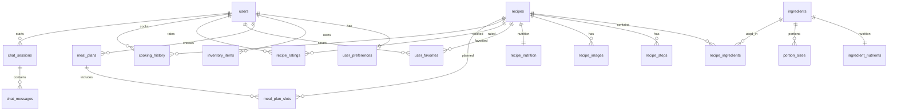

# Database Schema

The Cookest API uses **PostgreSQL 15+** accessed via **SeaORM 1.1**. Migrations run automatically at server startup — all operations use `IF NOT EXISTS` making them safe to replay.

## Entity groups

### Identity & preferences
- `users` — account credentials and profile
- `user_preferences` — per-user AI taste weight vectors (cuisine, ingredient, difficulty)

### Ingredients & nutrition
- `ingredients` — master ingredient catalog with nutrition metadata
- `ingredient_nutrients` — detailed macro/micronutrient values
- `portion_sizes` — common serving sizes per ingredient

### Recipes
- `recipes` — recipe metadata (title, description, cuisine, difficulty, times)
- `recipe_ingredients` — junction table bridging recipes ↔ ingredients with quantity/unit
- `recipe_steps` — ordered cooking instructions
- `recipe_images` — image URLs associated with recipes
- `recipe_nutrition` — pre-calculated macro totals for a recipe

### User interactions
- `user_favorites` — recipe saves/bookmarks per user
- `recipe_ratings` — 1–5 star ratings with optional notes
- `cooking_history` — timestamped record of every time a user cooks a recipe (triggers inventory deduction)

### Planning & inventory
- `inventory_items` — pantry items with quantity, unit, expiry date, storage location
- `meal_plans` — weekly plan container (week_start date)
- `meal_plan_slots` — individual meal assignments: day 0–6 × meal type (breakfast/lunch/dinner/snack)

### Subscriptions & payments
- `subscriptions` — Stripe subscription ID, tier, status, valid_until
- `store_promotions` — live price data from processed PDFs
- `store_promotion_candidates` — staging table for admin review before promotion

### AI chat
- `chat_sessions` — one session per conversation thread
- `chat_messages` — individual messages with role (user/assistant) and content

### Push notifications
- `push_tokens` — device push tokens (ios/android/web)

## ER Diagram

## Key relationships

- **`recipe_ingredients`** bridges recipes and ingredients, storing `quantity` and `unit` (e.g. 200 g).
- **`meal_plan_slots`** ties weekly plans to specific recipes and tracks `is_flex`, `flex_type`, `is_completed`, and `servings_override`.
- **`cooking_history`** triggers automatic inventory deduction scaled by `household_size`.
- **`user_preferences`** stores floating-point weight vectors that the online learning algorithm updates incrementally.

## Source of truth

<Callout type="info">
The migration SQL in `api/src/main.rs` is the canonical schema. This document reflects that schema — consult the source file for exact column types and constraints.
</Callout>
