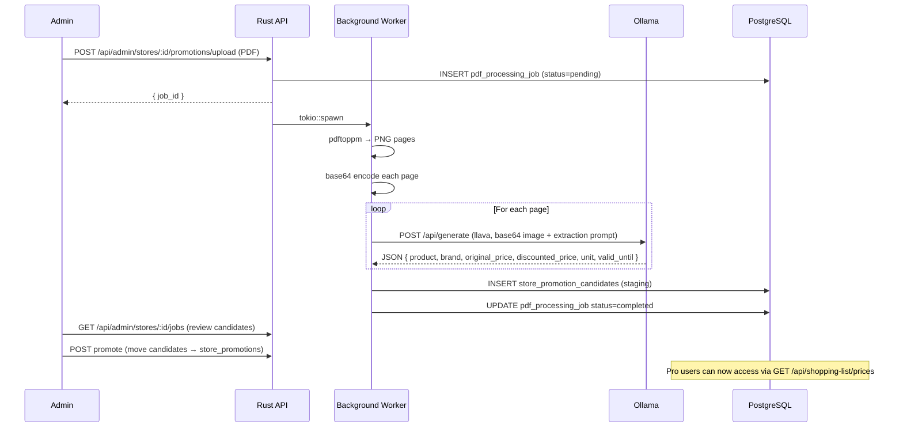

# PDF Price Scraping Pipeline

Cookest includes an admin-only pipeline that extracts product prices from weekly supermarket promotional flyers and makes them available to Pro users via the shopping list optimizer.

## Pipeline overview



## Requirements

```bash
# macOS
brew install poppler

# Debian/Ubuntu
sudo apt install poppler-utils

# Pull the vision model
ollama pull llava
```

## Admin endpoints

| Method | Path | Description |
|--------|------|-------------|
| `POST` | `/api/admin/stores` | Create a new store record |
| `POST` | `/api/admin/stores/:id/promotions/upload` | Upload weekly promo PDF |
| `GET` | `/api/admin/stores/:id/jobs` | Check job status |

All admin endpoints require a JWT with `is_admin: true` verified against the database (not just the token claim).

## Extraction prompt

The vision model is sent a structured prompt asking it to extract:
- Product name and brand
- Original price and discounted price
- Unit (per kg, per unit, per litre, etc.)
- Promotion validity dates

The response is parsed as JSON and inserted into `store_promotion_candidates` for admin review before going live.

## Pro user access

Once promotions are live, Pro tier users can:
- `GET /api/shopping-list/prices` — current prices for all items in their shopping list
- `GET /api/shopping-list/optimize` — cheapest single-store and cheapest multi-store split

<Callout type="info">
Price data is store-specific and promotion-based — not a real-time price feed. Prices reflect the most recently uploaded weekly flyer for each store.
</Callout>
