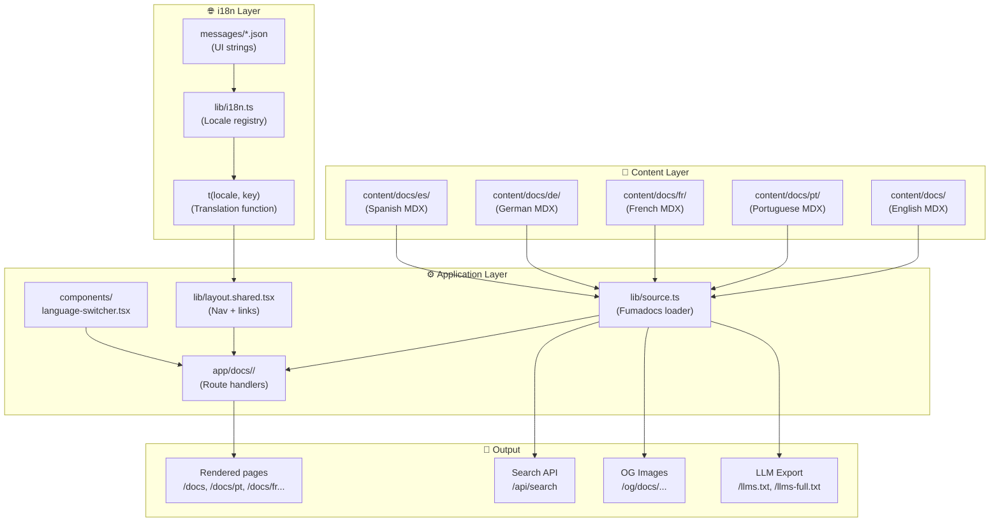

# Documentation Architecture

This page describes the internal architecture of the Cookest documentation site itself — how it's built, how translations work, and how to add new content or languages.

## Tech Stack

| Layer | Technology | Purpose |
|-------|-----------|---------|
| Framework | Next.js 16 (App Router) | SSG + routing |
| Docs engine | Fumadocs 16.8 | MDX content, sidebar, search |
| Styling | TailwindCSS 4 | UI components |
| Diagrams | Mermaid | Architecture/flow diagrams |
| i18n (content) | Fumadocs directory parser | Locale-specific MDX files |
| i18n (UI strings) | Custom JSON + `t()` function | Nav, buttons, labels |
| Icons | Lucide React | Navigation icons |

## High-Level Architecture



## Folder Structure

```
docs/
├── content/docs/                    ← MDX content (English = default)
│   ├── index.mdx                    ← Root landing page
│   ├── architecture/                ← System design docs
│   ├── backend/                     ← API documentation
│   ├── mobile/                      ← Flutter app docs
│   ├── user-guide/                  ← End-user tutorials
│   ├── etl/                         ← Data pipeline docs
│   ├── contributing/                ← This section
│   ├── ai/                          ← AI & automation docs
│   ├── pt/                          ← 🇵🇹 Portuguese (Tier 1 — full parity)
│   ├── fr/                          ← 🇫🇷 French (Tier 2 — community)
│   ├── de/                          ← 🇩🇪 German (Tier 2 — community)
│   └── es/                          ← 🇪🇸 Spanish (Tier 2 — community)
├── messages/                        ← JSON translation files for UI strings
│   ├── en.json
│   ├── pt.json
│   ├── fr.json
│   ├── de.json
│   └── es.json
├── lib/
│   ├── i18n.ts                      ← Central locale registry + t() function
│   ├── source.ts                    ← Fumadocs content loader
│   ├── layout.shared.tsx            ← Locale-aware nav configuration
│   └── shared.ts                    ← Constants (routes, git config)
├── components/
│   ├── language-switcher.tsx        ← Multi-language dropdown
│   ├── mdx.tsx                      ← MDX component overrides
│   └── mermaid.tsx                  ← Mermaid diagram renderer
├── app/
│   ├── docs/
│   │   ├── (en)/                    ← English routes (default, no prefix)
│   │   ├── pt/                      ← Portuguese routes (/docs/pt/...)
│   │   ├── fr/                      ← French routes (/docs/fr/...)
│   │   ├── de/                      ← German routes (/docs/de/...)
│   │   └── es/                      ← Spanish routes (/docs/es/...)
│   ├── api/search/                  ← Full-text search API
│   └── og/docs/                     ← OpenGraph image generation
└── messages/                        ← UI string translations
```

## i18n System

The documentation uses a **two-layer i18n system**:

### Layer 1: Content (MDX files)

Fumadocs handles content translation through its **directory parser**. Files are organized by locale:

- `content/docs/*.mdx` → English (default locale)
- `content/docs/pt/*.mdx` → Portuguese
- `content/docs/fr/*.mdx` → French
- etc.

The loader in `lib/source.ts` configures this:

```typescript
i18n: {
  defaultLanguage: 'en',
  languages: ['en', 'pt', 'fr', 'de', 'es'],
  parser: 'dir',
  fallbackLanguage: null,  // 404 if translation is missing
}
```

### Layer 2: UI Strings (JSON files)

Navigation labels, buttons, and other UI chrome are translated via JSON files in `messages/`. The `t()` function in `lib/i18n.ts` provides type-safe access:

```typescript
import { t } from '@/lib/i18n';

t('en', 'nav.docs')           // "Docs"
t('pt', 'nav.docs')           // "Documentação"
t('fr', 'common.nextPage')    // "Suivant"
```

### Locale Tiers

| Tier | Locales | Coverage | Maintenance |
|------|---------|----------|-------------|
| **Tier 1** | 🇬🇧 EN, 🇵🇹 PT | Full parity — every page translated | Core team |
| **Tier 2** | 🇫🇷 FR, 🇩🇪 DE, 🇪🇸 ES | Index/landing pages + high-value content | Community |

Tier 2 languages show a **β badge** in the language switcher and a **translation notice banner** on each page.

## URL Routing

| URL Pattern | Locale | Route Handler |
|-------------|--------|---------------|
| `/docs/...` | English | `app/docs/(en)/[[...slug]]/page.tsx` |
| `/docs/pt/...` | Portuguese | `app/docs/pt/[[...slug]]/page.tsx` |
| `/docs/fr/...` | French | `app/docs/fr/[[...slug]]/page.tsx` |
| `/docs/de/...` | German | `app/docs/de/[[...slug]]/page.tsx` |
| `/docs/es/...` | Spanish | `app/docs/es/[[...slug]]/page.tsx` |

English is the default locale and has no URL prefix (uses a Next.js route group `(en)`).

## Adding a New Language

See the [Translation Contribution Guide](/docs/contributing/translations) for the full step-by-step process.
