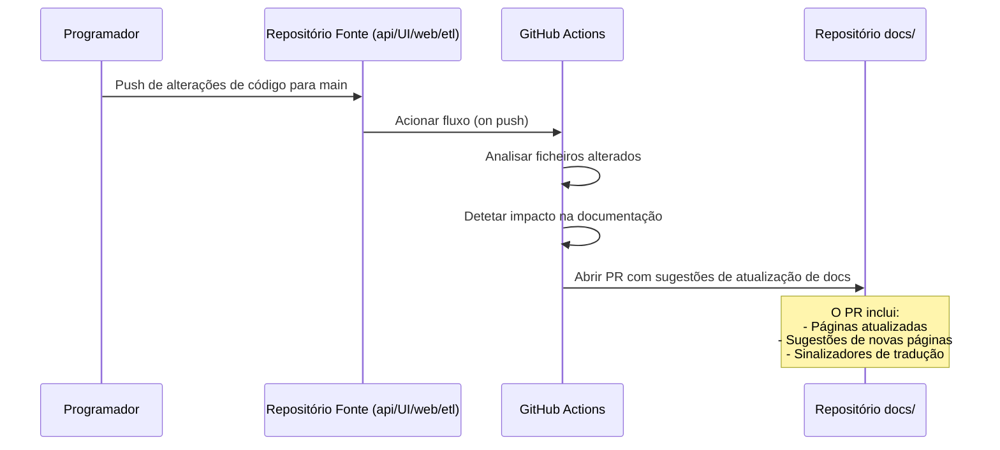

# Auto-Documentação

O sistema de auto-documentação usa o GitHub Actions para detetar quando o código muda e a documentação pode estar desatualizada, abrindo depois pull requests para atualizar os docs.

## Como Funciona



## Arquitetura

O sistema tem dois componentes:

### 1. Fluxo do Repositório Fonte

Cada repositório fonte (`api/`, `UI/`, `web/`, `etl/`) tem um fluxo GitHub Actions que:

1. Aciona no push para `main`
2. Analisa quais ficheiros mudaram
3. Mapeia as alterações para secções de documentação
4. Envia um evento `repository_dispatch` para o repositório docs

### 2. Fluxo do Repositório Docs

O repositório docs recebe eventos de dispatch e:

1. Lê o payload de alterações (quais ficheiros, quais secções)
2. Verifica se as páginas de documentação referenciadas existem e estão atualizadas
3. Sinaliza páginas que possam necessitar de atualizações
4. Abre um PR com:
   - Uma lista de verificação de páginas a rever
   - Atualizações de conteúdo sugeridas (se determinísticas)
   - Notas de impacto na tradução (quais idiomas precisam de atualizações)

## Mapeamento Alteração → Documentação

O sistema mapeia caminhos de código-fonte para secções de documentação:

### Repositório API

| Padrão de Caminho | Secção de Documentação |
|---|---|
| `src/handlers/auth.rs` | `backend/authentication`, `backend/endpoints/auth` |
| `src/handlers/recipe.rs` | `backend/endpoints/recipes` |
| `src/handlers/meal_plan.rs` | `backend/endpoints/meal-plans` |
| `src/entity/*.rs` | `backend/database` |
| `src/services/*.rs` | `backend/` (página de endpoint relevante) |
| `Cargo.toml` | `architecture/repositories` |
| `docker-compose.yml` | `backend/getting-started` |

### Repositório UI

| Padrão de Caminho | Secção de Documentação |
|---|---|
| `lib/src/features/auth/` | `mobile/screens` (secção auth) |
| `lib/src/features/recipes/` | `mobile/screens` (secção recipes) |
| `lib/src/shared/theme/` | `mobile/theme` |
| `lib/src/core/api/` | `mobile/api-integration` |
| `pubspec.yaml` | `architecture/repositories` |

### Repositório ETL

| Padrão de Caminho | Secção de Documentação |
|---|---|
| `main.py` | `etl/overview` |
| `requirements.txt` | `architecture/repositories` |

## Fluxo do Repositório Fonte

Adicionar este fluxo a cada repositório fonte (`.github/workflows/notify-docs.yml`):

```yaml
name: Notify Documentation

on:
  push:
    branches: [main]

jobs:
  notify-docs:
    runs-on: ubuntu-latest
    steps:
      - uses: actions/checkout@v4
        with:
          fetch-depth: 2

      - name: Detect changed files
        id: changes
        run: |
          echo "files=$(git diff --name-only HEAD~1 HEAD | jq -R -s -c 'split("\n") | map(select(. != ""))')" >> $GITHUB_OUTPUT

      - name: Dispatch to docs
        uses: peter-evans/repository-dispatch@v3
        with:
          token: ${{ secrets.DOCS_DISPATCH_TOKEN }}
          repository: Cookest/docs
          event-type: code-change
          client-payload: |
            {
              "repo": "${{ github.repository }}",
              "ref": "${{ github.sha }}",
              "files": ${{ steps.changes.outputs.files }},
              "commit_message": "${{ github.event.head_commit.message }}",
              "author": "${{ github.event.head_commit.author.name }}"
            }
```

## Fluxo do Repositório Docs

O repositório docs recebe estes eventos (`.github/workflows/auto-docs.yml`):

```yaml
name: Auto-Documentation

on:
  repository_dispatch:
    types: [code-change]
  workflow_dispatch:
    inputs:
      repo:
        description: 'Repository that changed (e.g., Cookest/api)'
        required: true
      files:
        description: 'JSON array of changed file paths'
        required: true

jobs:
  analyze-and-pr:
    runs-on: ubuntu-latest
    steps:
      - uses: actions/checkout@v4

      - name: Analyze documentation impact
        id: analyze
        run: |
          node scripts/analyze-docs-impact.js \
            --repo '${{ github.event.client_payload.repo || github.event.inputs.repo }}' \
            --files '${{ github.event.client_payload.files || github.event.inputs.files }}'

      - name: Create documentation update PR
        if: steps.analyze.outputs.has_impact == 'true'
        uses: peter-evans/create-pull-request@v7
        with:
          token: ${{ secrets.GITHUB_TOKEN }}
          commit-message: "docs: flag pages needing review after code change"
          title: "docs: review needed — changes in ${{ github.event.client_payload.repo || github.event.inputs.repo }}"
          body: |
            ## Auto-Documentation Review

            Code changes in `${{ github.event.client_payload.repo || github.event.inputs.repo }}` may affect these documentation pages:

            ${{ steps.analyze.outputs.affected_pages }}

            ### Action Required
            - [ ] Review each flagged page for accuracy
            - [ ] Update content if needed
            - [ ] Update translations for changed pages

            ---
            *This PR was automatically created by the auto-documentation system.*
            *Commit: ${{ github.event.client_payload.ref }}*
            *Author: ${{ github.event.client_payload.author }}*
          branch: auto-docs/${{ github.run_id }}
          labels: documentation,auto-generated
```

## Impacto nas Traduções

Quando uma página de documentação é atualizada, o sistema também sinaliza o impacto nas traduções:

- **Idiomas Tier 1 (EN, PT):** O PR inclui um item de lista de verificação para atualização da tradução portuguesa
- **Idiomas Tier 2 (FR, DE, ES):** Indicado no corpo do PR mas não bloqueador

## Acionamento Manual

O fluxo suporta acionamento manual para revisões de documentação ad-hoc:

1. Ir ao repositório docs → Actions → Auto-Documentation
2. Clicar em "Run workflow"
3. Inserir o repositório e os ficheiros alterados
4. O fluxo cria um PR de revisão

## Requisitos de Configuração

### Segredos

| Segredo | Repositório | Descrição |
|---------|-------------|-----------|
| `DOCS_DISPATCH_TOKEN` | Repos fonte (api, UI, web, etl) | Token de acesso pessoal com âmbito `repo` para dispatch para o repositório docs |

### Permissões

O repositório docs deve permitir:
- GitHub Actions criar pull requests
- Eventos de repository dispatch dos repositórios fonte
