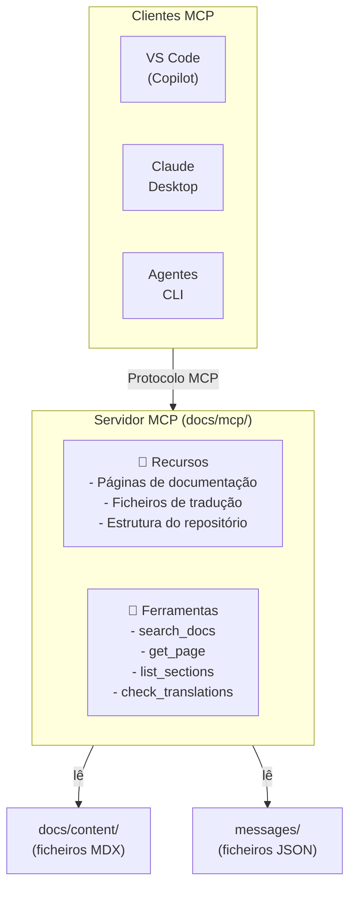

# Servidor MCP

O servidor MCP (Model Context Protocol) do Cookest fornece acesso programático à documentação, permitindo que os agentes de IA pesquisem, leiam e compreendam o ecossistema Cookest sem necessidade de navegar manualmente pelos ficheiros.

## O que é o MCP?

O [Model Context Protocol](https://modelcontextprotocol.io/) é um padrão aberto para ligar modelos de IA a fontes de dados externas e ferramentas. Um servidor MCP expõe **recursos** (dados para leitura) e **ferramentas** (ações a executar) que os agentes de IA podem utilizar.

## Arquitetura



## Configuração

### Pré-requisitos

- Node.js 20+ ou Bun 1.x
- O repositório docs clonado localmente

### Instalação

```bash
cd docs/mcp
npm install
```

### Configuração

Criar `docs/mcp/.env`:

```bash
DOCS_ROOT=../content/docs
MESSAGES_ROOT=../messages
PORT=3100
```

### Executar

```bash
# Desenvolvimento
cd docs/mcp
npm run dev

# Produção
npm run build && npm start
```

## Recursos Disponíveis

Os recursos MCP são dados de leitura que os agentes podem aceder.

### `docs://pages`

Lista todas as páginas de documentação com metadados.

```json
{
  "uri": "docs://pages",
  "name": "Documentation Pages",
  "description": "List of all documentation pages across all locales",
  "mimeType": "application/json"
}
```

### `docs://page/{locale}/{path}`

Devolve o conteúdo de uma página de documentação específica.

```json
{
  "uri": "docs://page/en/backend/getting-started",
  "name": "Backend Getting Started (EN)",
  "mimeType": "text/markdown"
}
```

### `docs://translations/{locale}`

Devolve as strings de tradução da interface para um idioma.

```json
{
  "uri": "docs://translations/pt",
  "name": "Portuguese Translations",
  "mimeType": "application/json"
}
```

### `docs://structure`

Devolve o mapa da estrutura do repositório.

```json
{
  "uri": "docs://structure",
  "name": "Cookest Repository Structure",
  "description": "Map of all repositories, their purpose, and tech stack",
  "mimeType": "application/json"
}
```

## Ferramentas Disponíveis

As ferramentas MCP são ações que os agentes podem invocar.

### `search_docs`

Pesquisa de texto completo em todas as páginas de documentação.

**Parâmetros:**
| Nome | Tipo | Obrigatório | Descrição |
|------|------|-------------|-----------|
| `query` | string | ✅ | Consulta de pesquisa |
| `locale` | string | ❌ | Filtrar por idioma (padrão: todos) |
| `section` | string | ❌ | Filtrar por secção (backend, mobile, etc.) |
| `limit` | number | ❌ | Máximo de resultados (padrão: 10) |

**Exemplo:**
```json
{
  "name": "search_docs",
  "arguments": {
    "query": "JWT authentication refresh token",
    "locale": "en",
    "limit": 5
  }
}
```

### `get_page`

Obtém uma página de documentação específica pelo caminho.

**Parâmetros:**
| Nome | Tipo | Obrigatório | Descrição |
|------|------|-------------|-----------|
| `path` | string | ✅ | Caminho da página (ex.: "backend/authentication") |
| `locale` | string | ❌ | Idioma (padrão: "en") |

### `list_sections`

Lista todas as secções de documentação e as respetivas páginas.

**Parâmetros:**
| Nome | Tipo | Obrigatório | Descrição |
|------|------|-------------|-----------|
| `locale` | string | ❌ | Idioma (padrão: "en") |

### `check_translations`

Verifica a cobertura de tradução para um idioma.

**Parâmetros:**
| Nome | Tipo | Obrigatório | Descrição |
|------|------|-------------|-----------|
| `locale` | string | ✅ | Idioma alvo a verificar |

**Devolve:**
```json
{
  "locale": "fr",
  "tier": 2,
  "coverage": {
    "pages": { "total": 32, "translated": 1, "percentage": 3.1 },
    "uiStrings": { "total": 24, "translated": 24, "percentage": 100 }
  },
  "missingPages": [
    "backend/getting-started",
    "backend/authentication",
    "mobile/overview"
  ]
}
```

## Configuração do Cliente

### VS Code (GitHub Copilot)

Adicionar ao `.vscode/settings.json`:

```json
{
  "github.copilot.chat.mcpServers": {
    "cookest-docs": {
      "command": "node",
      "args": ["docs/mcp/dist/index.js"],
      "env": {
        "DOCS_ROOT": "${workspaceFolder}/docs/content/docs",
        "MESSAGES_ROOT": "${workspaceFolder}/docs/messages"
      }
    }
  }
}
```

### Claude Desktop

Adicionar ao `claude_desktop_config.json`:

```json
{
  "mcpServers": {
    "cookest-docs": {
      "command": "node",
      "args": ["/path/to/docs/mcp/dist/index.js"],
      "env": {
        "DOCS_ROOT": "/path/to/docs/content/docs",
        "MESSAGES_ROOT": "/path/to/docs/messages"
      }
    }
  }
}
```

## Implementação

O servidor MCP está implementado em TypeScript usando o pacote `@modelcontextprotocol/sdk`. O código-fonte encontra-se em `docs/mcp/`.

```
docs/mcp/
├── package.json
├── tsconfig.json
├── src/
│   ├── index.ts          ← Ponto de entrada do servidor
│   ├── resources.ts      ← Handlers de recursos
│   ├── tools.ts          ← Handlers de ferramentas
│   └── utils.ts          ← Leitura de ficheiros, pesquisa, parsing
└── dist/                 ← Saída compilada
```

### Contribuir

Ao estender o servidor MCP:
1. Adicionar novas ferramentas/recursos no ficheiro handler adequado
2. Atualizar esta página de documentação
3. Testar com pelo menos um cliente MCP
4. Seguir as convenções TypeScript em [Boas Práticas](/docs/contributing/best-practices)
