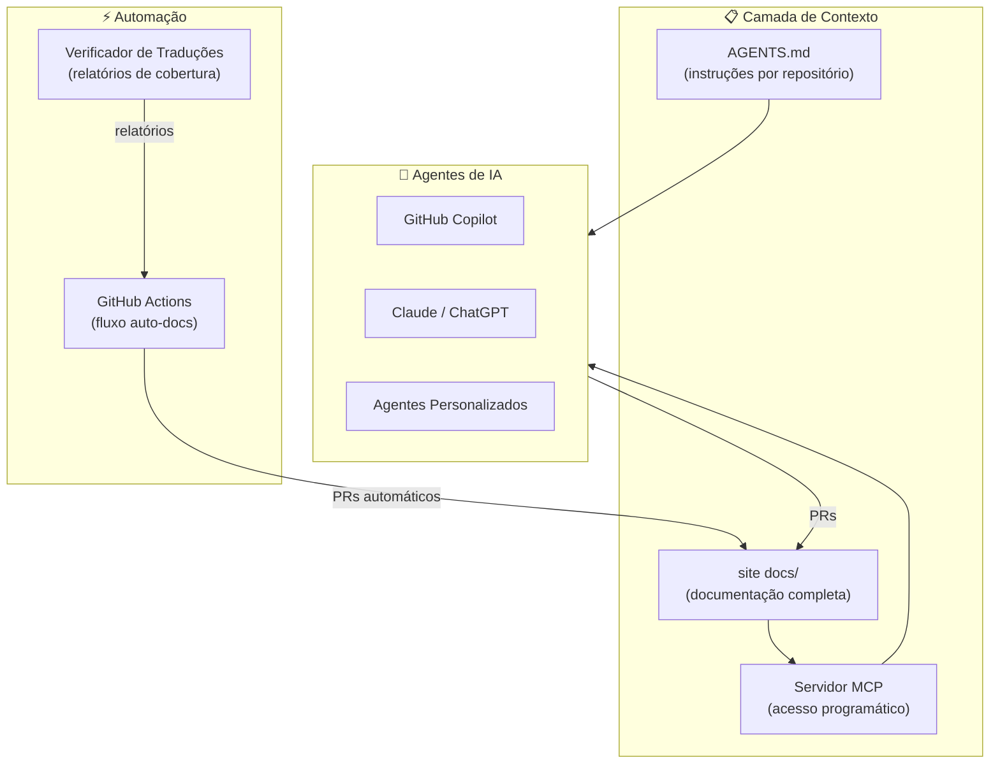

# IA e Automação

O Cookest abraça o desenvolvimento assistido por IA como uma preocupação de primeira ordem. Esta secção documenta como os agentes de IA trabalham com a base de código, que ferramentas e contexto têm disponíveis, e como a automação mantém a documentação sincronizada com o código.

## Filosofia

1. **A IA é um colaborador, não um substituto.** Os agentes de IA seguem os mesmos padrões que os colaboradores humanos — mesmo formato de commits, mesmo processo de PR, mesmo nível de qualidade
2. **O contexto é tudo.** Os agentes funcionam melhor com contexto explícito e estruturado. Cada repositório fornece um `AGENTS.md` que diz aos agentes o que precisam de saber
3. **A documentação orienta o desenvolvimento.** O site de docs é a fonte única de verdade. Os agentes leem-na antes de fazer alterações e atualizam-na depois
4. **A automação reduz a divergência.** O GitHub Actions deteta quando o código e a documentação divergem e abre PRs para corrigir

## Componentes

## O que Existe Nesta Secção

| Página | Descrição |
|--------|-----------|
| [Competências Agênticas](/docs/ai/skills) | Conjunto completo de competências, capacidades e padrões para agentes de IA a trabalhar no Cookest |
| [Instruções de Agente](/docs/ai/instructions) | Instruções detalhadas que cada agente recebe ao trabalhar em qualquer repositório Cookest |
| [Servidor MCP](/docs/ai/mcp-server) | Servidor Model Context Protocol que fornece contexto de documentação às ferramentas de IA |
| [Auto-Documentação](/docs/ai/auto-docs) | Fluxo de trabalho GitHub Actions que mantém os docs sincronizados com as alterações de código |
