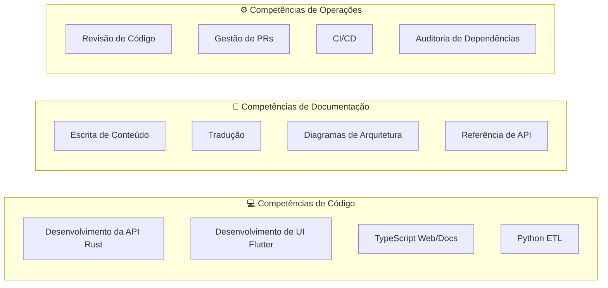

# Competências Agênticas

Esta página define o conjunto completo de competências que um agente de IA deve ter ao trabalhar no Cookest. Cada competência inclui o seu propósito, quando aplicar e como executar corretamente.

## Categorias de Competências



---

## Competências de Código

### SK-01: Desenvolvimento da API Rust

**Quando:** Criar ou modificar endpoints, serviços ou modelos de dados.

**Contexto necessário:**
- Ler `api/README.md` para visão geral dos endpoints
- Ler `api/docs/database/SCHEMA.md` para o esquema da base de dados
- Ler handlers/services existentes no mesmo domínio

**Padrões:**
```
Handler (thin) → Service (lógica) → Entity (dados)
```

**Lista de verificação:**
- [ ] O handler valida o input usando regras de `validation/`
- [ ] O service contém toda a lógica de negócio
- [ ] A entity usa SeaORM com `#[derive(Clone, Debug, DeriveEntityModel)]`
- [ ] Os erros usam `AppError` de `errors.rs`
- [ ] Middleware de autenticação aplicado se o endpoint necessitar autenticação
- [ ] Limitação de taxa configurada via governor
- [ ] Nível de subscrição verificado se a funcionalidade estiver bloqueada
- [ ] Testes cobrem caminho feliz + casos de erro

### SK-02: Desenvolvimento de UI Flutter

**Quando:** Criar ou modificar ecrãs, widgets ou gestão de estado.

**Contexto necessário:**
- Ler `UI/lib/src/shared/theme/` para constantes de cor/tipografia
- Ler módulos de funcionalidade existentes para padrões
- Verificar providers Riverpod na mesma funcionalidade

**Padrões:**
```
Screen → Provider (Riverpod) → Repository → API Client (Dio)
```

**Lista de verificação:**
- [ ] Usar construtores `const` sempre que possível
- [ ] Seguir o tema Material 3 com verde-sálvia (#7A9A65)
- [ ] Provider Riverpod por preocupação de dados
- [ ] GoRouter para navegação (sem `Navigator.push` manual)
- [ ] Considerações de layout responsivo
- [ ] Suporte a modo escuro via tokens de tema
- [ ] Estados de erro tratados na UI

### SK-03: Desenvolvimento TypeScript Web/Docs

**Quando:** Modificar a página de destino ou o site de documentação.

**Contexto necessário:**
- Web: Ler `web/app/components/` para padrões existentes
- Docs: Ler `docs/lib/i18n.ts` para o sistema de idiomas
- Ler `messages/*.json` para chaves de tradução

**Lista de verificação:**
- [ ] Componentes usam TypeScript strict mode
- [ ] Traduções usam `t(locale, key)` — sem strings fixas
- [ ] TailwindCSS para estilização
- [ ] Design responsivo (mobile-first)
- [ ] Modo escuro via theme provider
- [ ] Framer Motion para animações (apenas web)

### SK-04: Desenvolvimento Python ETL

**Quando:** Modificar pipelines de ingestão de dados.

**Contexto necessário:**
- Ler `etl/README.md` para visão geral do pipeline
- Verificar `api/docs/database/SCHEMA.md` para o esquema alvo
- Compreender a configuração de limitação de taxa

**Lista de verificação:**
- [ ] Lógica de upsert (ON CONFLICT) para idempotência
- [ ] Limitação de taxa respeitada para APIs externas
- [ ] Barras de progresso via tqdm
- [ ] Tratamento de erros com logging (não print)
- [ ] Type hints em todas as funções

---

## Competências de Documentação

### SK-05: Escrita de Conteúdo

**Quando:** Escrever novas páginas de documentação ou atualizar existentes.

**Contexto necessário:**
- Ler `docs/content/docs/contributing/guide.mdx` para os padrões
- Ler páginas existentes na mesma secção para consistência de voz
- Verificar o código-fonte para exatidão

**Lista de verificação:**
- [ ] Frontmatter com `title` e `description`
- [ ] H1 corresponde ao título do frontmatter
- [ ] Profundidade máxima H3 (nunca H4+)
- [ ] Blocos de código têm etiquetas de linguagem
- [ ] Tabelas para dados estruturados
- [ ] Mermaid para diagramas
- [ ] Callouts para avisos/notas
- [ ] Adicionado ao `meta.json` da secção

### SK-06: Tradução

**Quando:** Traduzir documentação para um novo idioma ou atualizar traduções existentes.

**Contexto necessário:**
- Ler `docs/content/docs/contributing/translations.mdx`
- Ler `messages/en.json` para a estrutura de strings da interface
- Verificar o guia de estilo específico do idioma

**Lista de verificação:**
- [ ] Toda a prosa traduzida, blocos de código mantidos em inglês
- [ ] Frontmatter traduzido
- [ ] `meta.json` atualizado para o idioma
- [ ] Ficheiro de mensagens JSON atualizado se as strings da UI mudaram
- [ ] Banner de tradução comunitária adicionado (idiomas Tier 2)
- [ ] Termos técnicos mantidos em inglês (JWT, API, webhook)

### SK-07: Diagramas de Arquitetura

**Quando:** Documentar design de sistema, fluxos de dados ou relações entre componentes.

**Ferramenta:** Mermaid (renderizado nativamente pelo Fumadocs).

**Tipos de diagrama:**
| Tipo | Caso de Uso |
|------|-------------|
| `graph TD` | Arquitetura de componentes, fluxo de dados |
| `sequenceDiagram` | Fluxos de autenticação, pedido/resposta |
| `erDiagram` | Esquema da base de dados |
| `flowchart` | Árvores de decisão, pipelines |

### SK-08: Documentação de Referência da API

**Quando:** Documentar endpoints novos ou alterados.

**Estrutura por endpoint:**

```markdown
## Nome do Endpoint

| Método | Caminho | Auth | Tier |
|--------|---------|------|------|
| POST | `/api/v1/resource` | Bearer | Pro |

### Corpo do Pedido
{bloco de código com exemplo JSON}

### Resposta
{bloco de código com exemplo JSON}

### Códigos de Erro
{tabela de possíveis erros}
```

---

## Competências de Operações

### SK-09: Revisão de Código

**Quando:** Rever PRs de colaboradores humanos ou de IA.

**Áreas de foco:**
1. **Correção** — O código faz o que afirma?
2. **Segurança** — Sem segredos, autenticação adequada, validação de input
3. **Performance** — Sem consultas N+1, indexação adequada
4. **Consistência** — Segue as convenções do projeto
5. **Documentação** — Alterações refletidas nos docs

### SK-10: Gestão de PRs

**Quando:** Criar, atualizar ou fundir pull requests.

**Convenções de commit:**
```
<tipo>(<âmbito>): <descrição>
```

**Título do PR:** Mesmo formato que as mensagens de commit.

**Corpo do PR:** Deve incluir as secções O quê, Porquê, Como, Testes.

### SK-11: Pipeline CI/CD

**Quando:** Adicionar ou modificar fluxos de trabalho automatizados.

**Pipelines disponíveis:**
- `auto-docs.yml` — Deteta alterações de código, sugere atualizações de docs
- `translation-check.yml` — Reporta cobertura de tradução

### SK-12: Auditoria de Dependências

**Quando:** Rever ou atualizar dependências do projeto.

**Ferramentas por linguagem:**
| Linguagem | Comando de Auditoria |
|-----------|----------------------|
| Rust | `cargo audit` |
| Dart | `flutter pub outdated` |
| Node.js | `npm audit` |
| Python | `pip-audit` |

---

## Matriz de Aplicação de Competências

| Competência | api | UI | web | docs | etl |
|-------------|:---:|:--:|:---:|:----:|:---:|
