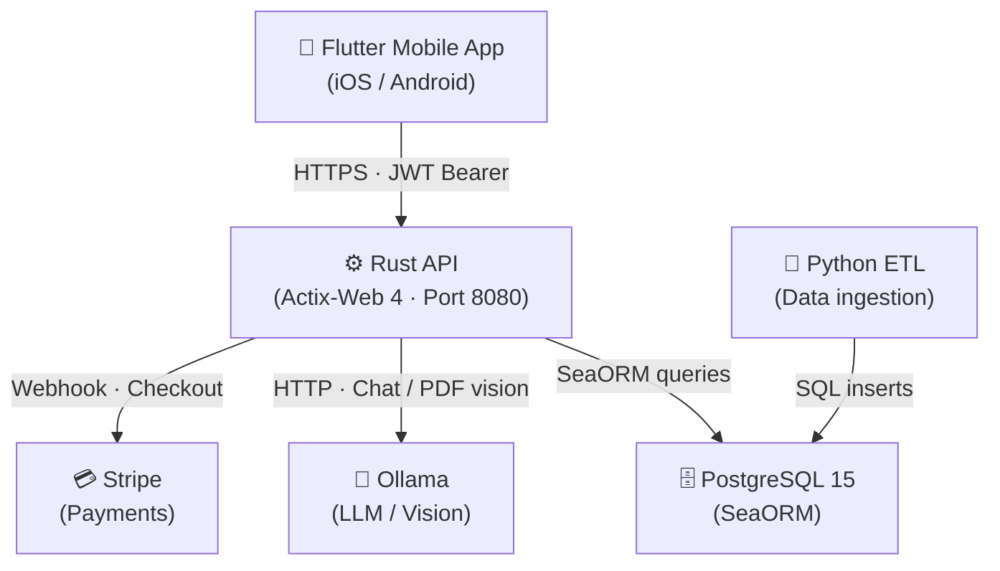

# Visão Geral da Arquitetura

O Cookest está organizado em três componentes independentes que comunicam via HTTP.

## Diagrama de componentes

## Componentes

### API Rust (`api/`)

O núcleo da plataforma. Construída com **Actix-Web 4** para processamento assíncrono de alto desempenho. Principais responsabilidades:
- Autenticação baseada em JWT com par de tokens de acesso + atualização
- Gestão de receitas (CRUD + favoritos + avaliações + registo de confeção)
- Geração de planos de refeições semanais com pontuação por IA
- Gestão de inventário/despensa com alertas de validade
- Lista de compras com comparação de preços opcional
- Chat com IA via Ollama (llava para visão PDF, modelo geral para chat)
- Subscrição Stripe com idempotência de webhook

### Aplicação Móvel Flutter (`UI/`)

Um cliente iOS/Android multiplataforma com um sistema de design de marca personalizado. Características principais:
- **Riverpod** para toda a gestão de estado
- **GoRouter** com uma rota shell de 5 separadores
- Tipografia Playfair Display + Inter
- Cor de marca verde-sálvia (`#7A9A65`) em toda a aplicação
- Todas as chamadas à API são feitas através de classes de repositório usando Dio

### Python ETL (`etl/`)

Um pipeline de ingestão de dados que processa dados externos de alimentos e nutrição e alimenta a base de dados PostgreSQL utilizada pela API.

## Decisões de design importantes

### Nível de subscrição no JWT

O nível de subscrição do utilizador (`free` / `pro` / `family`) está incorporado em cada token de acesso. Isto permite que o middleware da API restrinja funcionalidades Pro sem uma consulta à base de dados em cada pedido. O nível é relido da base de dados cada vez que o token é atualizado (TTL de 15 minutos).

### Aprendizagem de preferências online

O `PreferenceService` aplica atualizações incrementais por gradiente descendente (taxa de aprendizagem 0.01) aos vetores de peso de culinária/ingrediente/dificuldade por utilizador sempre que um utilizador avalia ou conclui uma receita. Com o tempo, a geração de planos de refeições torna-se cada vez mais personalizada.

### Migrações idempotentes

Todas as alterações de esquema utilizam `CREATE TABLE IF NOT EXISTS` e `ALTER TABLE ... ADD COLUMN IF NOT EXISTS`. As migrações são executadas automaticamente em cada arranque do servidor — seguro para todos os cenários de implementação.

### Tokens de atualização SHA-256

Os tokens de atualização são armazenados na base de dados como `sha256(raw_token)`. O token em bruto é mantido apenas pelo cliente num cookie httpOnly. Mesmo um dump completo da base de dados não pode ser utilizado para forjar sessões válidas.

### Endpoints de administrador — BD, não JWT

As rotas exclusivas de administrador verificam sempre `is_admin = true` consultando a base de dados, independentemente do que as claims do JWT contenham.
