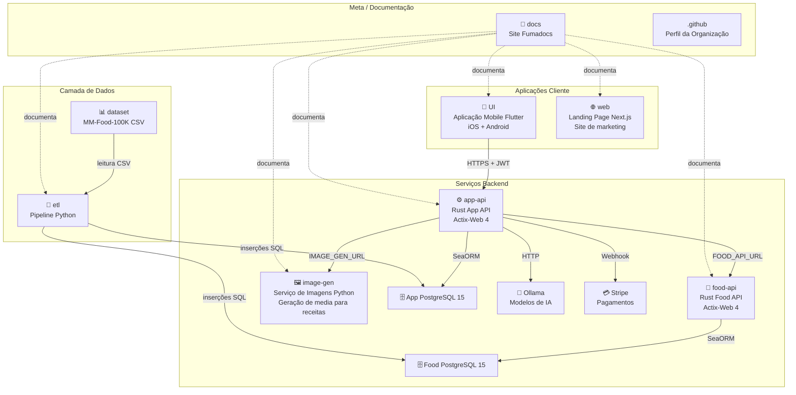
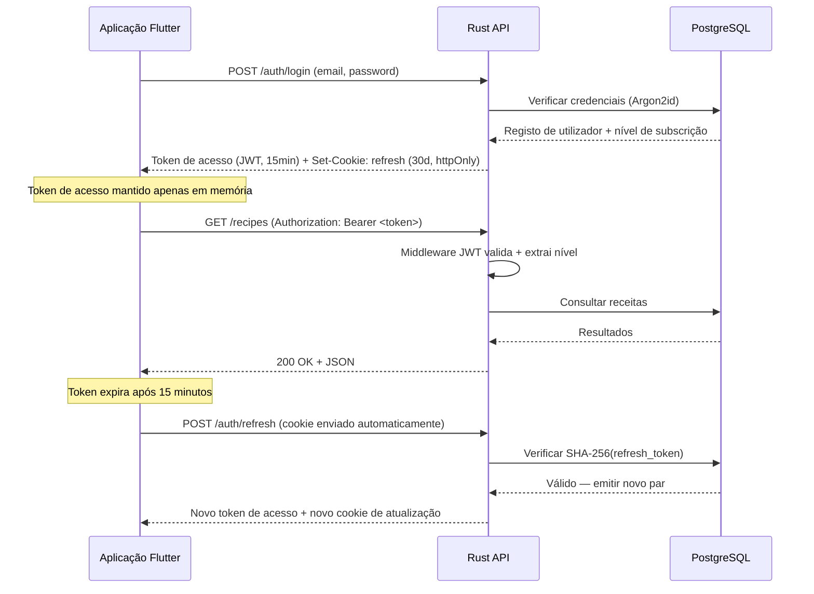
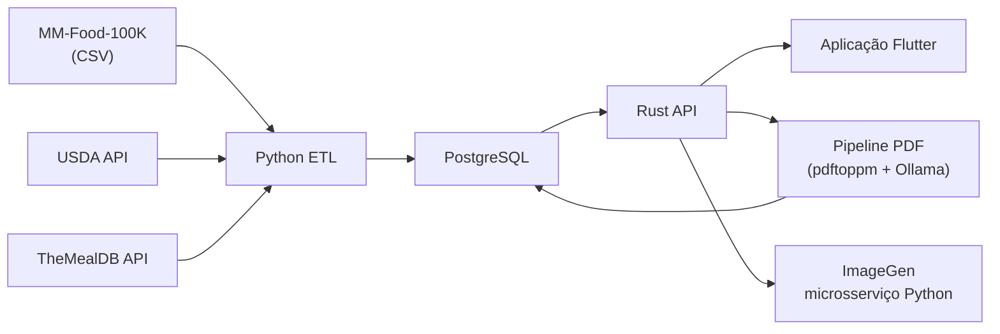

# Guia de Repositórios

O Cookest é um projeto multi-repositório. Cada repositório é um componente independente com o seu próprio histórico Git, CI/CD e deployment. Esta página documenta o que cada repositório faz e como se interligam.

## Mapa do Ecossistema



## Detalhes dos Repositórios

### `api/` — Workspace Backend

| Atributo | Valor |
|----------|-------|
| **Linguagens** | Rust 1.78+ + Python 3.10+ |
| **Frameworks** | Actix-Web 4, SeaORM 1.1, microsserviço Python estilo FastAPI |
| **Workspace** | Workspace Cargo multi-crate |
| **Serviços** | `app-api`, `food-api`, `image-gen` |
| **Crate partilhado** | `crates/shared` para erros e tipos comuns |
| **Base de dados** | PostgreSQL 15+ |
| **IA** | Ollama + geração assíncrona de imagens |

**Propósito:** O repositório `api/` contém agora o workspace backend completo: a App API deployed, a Food API standalone, crates Rust partilhados, o monólito legado retido para referência, e o microsserviço Python de geração de imagens.

**Diretórios principais:**
```bash
api/
├── src/                    ← monólito legado (não é o binário deployed)
├── crates/app-api/         ← App API deployed com auth, meal plans, despensa, chat IA e proxies
├── crates/food-api/        ← serviço standalone de catálogo de alimentos
├── crates/shared/          ← erros partilhados, DTOs e tipos comuns
└── image-gen/              ← microsserviço Python de geração de imagens
```

**Funções dos crates/serviços:**
- `crates/app-api` — a API principal deployed usada por clientes mobile e web
- `crates/food-api` — serviço de catálogo e navegação para receitas e ingredientes
- `crates/shared` — erros reutilizáveis e tipos Rust partilhados
- `image-gen/` — serviço assíncrono de geração de imagens hero/passo para receitas
- `src/` — código do monólito legado, mantido apenas para fins de migração/referência

**Início rápido:**
```bash
cd api
cp .env.example .env
docker compose up --build
```

---

### `UI/` — Aplicação Mobile Flutter

| Atributo | Valor |
|----------|-------|
| **Linguagem** | Dart 3.x |
| **Framework** | Flutter 3.x |
| **Estado** | Riverpod 2.5 |
| **Navegação** | GoRouter 17 |
| **HTTP** | Dio 5.9 + gestor de cookies |
| **Design** | Material 3, verde-sálvia (#7A9A65) |

**Propósito:** Cliente nativo iOS/Android para planeamento de refeições, compras, gestão de despensa e chat com IA.

**Diretórios principais:**
```bash
UI/lib/src/
├── core/          ← cliente API, autenticação, armazenamento
├── features/      ← Módulos de funcionalidade (auth, recipes, meal_plan, etc.)
└── shared/        ← Widgets reutilizáveis, tema, componentes
```

**Início rápido:**
```bash
cd UI
flutter pub get
flutter run                     # Executar em dispositivo/emulador ligado
```

---

### `web/` — Landing Page Next.js

| Atributo | Valor |
|----------|-------|
| **Linguagem** | TypeScript 5 |
| **Framework** | Next.js 16 (App Router) |
| **Estilização** | TailwindCSS 4 |
| **Animações** | Framer Motion 12 |
| **i18n** | TranslationProvider personalizado (5 idiomas) |

**Propósito:** Site de marketing público que apresenta as funcionalidades do Cookest, links para download da app e missão de sustentabilidade.

**Componentes principais:**
```bash
web/app/components/
├── Nav.tsx, Hero.tsx, Features.tsx
├── Showcase.tsx, HowItWorks.tsx
├── Sustainability.tsx, Download.tsx
├── TranslationProvider.tsx      ← contexto i18n
└── ShaderCanvas.tsx             ← efeitos WebGL
```

**Início rápido:**
```bash
cd web
npm install
npm run dev                     # Iniciar em localhost:3000
```

---

### `cookest-ad/` — Anúncios de vídeo Remotion

| Atributo | Valor |
|----------|-------|
| **Linguagem** | TypeScript 5 |
| **Framework** | Remotion |
| **Composição** | Composição de anúncio de 5 cenas orientada por cursor |
| **Automação** | Automação de capturas com Puppeteer |

**Propósito:** Gera recursos de anúncios de vídeo polidos para campanhas de marketing e promoções do Cookest.

---

### `etl/` — Pipeline de Dados Python

| Atributo | Valor |
|----------|-------|
| **Linguagem** | Python 3.10+ |
| **Base de dados** | psycopg2 → PostgreSQL |
| **APIs** | USDA FoodData Central, TheMealDB |
| **Dados** | MM-Food-100K (~100K receitas) |

**Propósito:** Extrair, transformar e carregar dados de receitas e nutrição para a base de dados PostgreSQL.

**Fases do pipeline:**
1. **Extrair** → Ler CSV + respostas de API com limitação de taxa
2. **Transformar** → Normalizar ingredientes, desduplicar, converter unidades, enriquecer nutrição
3. **Carregar** → Upsert em massa para PostgreSQL (idempotente)

**Início rápido:**
```bash
cd etl
python -m venv .venv && source .venv/bin/activate
pip install -r requirements.txt
cp .env.example .env            # Definir DATABASE_URL, USDA_API_KEY
python main.py
```

---

### `dataset/` — Dados de Receitas

Contém `MM-Food-100K.csv` — aproximadamente 100.000 registos de receitas com:
- Nome de receita, cozinha, método de confeção
- Listas de ingredientes (JSON)
- Perfis nutricionais (calorias, gordura, proteína, hidratos de carbono)
- Porções com equivalentes em gramas
- URLs de imagens

Este CSV é consumido pelo pipeline ETL.

---

### `docs/` — Site de Documentação

| Atributo | Valor |
|----------|-------|
| **Framework** | Next.js 16 + Fumadocs 16.8 |
| **Conteúdo** | Ficheiros MDX (Markdown + JSX) |
| **Idiomas** | EN, PT (Tier 1) + FR, DE, ES (Tier 2) |
| **Runtime** | Bun |

**Propósito:** Documentação centralizada para todo o ecossistema. Está a lê-la agora.

Ver [Arquitetura da Documentação](/docs/contributing/docs-architecture) para detalhes técnicos.

---

### `.github/` — Perfil da Organização

Contém o README do perfil da organização GitHub e os recursos apresentados na página da organização Cookest no GitHub. Repositório Git separado.

## Como os Componentes se Ligam

### Fluxo de Autenticação



### Fluxo de Dados



### Níveis de Subscrição

| Funcionalidade | Free | Pro (€9,99/mês) | Family (€14,99/mês) |
|----------------|:----:|:---------------:|:--------------------:|
| Inventário + plano de refeições | ✅ | ✅ | ✅ |
| Geração de plano de refeições com IA | ❌ | ✅ | ✅ |
| Chat com IA | 10/dia | ∞ | ∞ |
| Comparação de preços | ❌ | ✅ | ✅ |
| Receitas criadas pelo utilizador | ❌ | ✅ | ✅ |
| Otimizador de lista de compras | ❌ | ✅ | ✅ |
| Múltiplos perfis familiares | ❌ | ❌ | ✅ |
