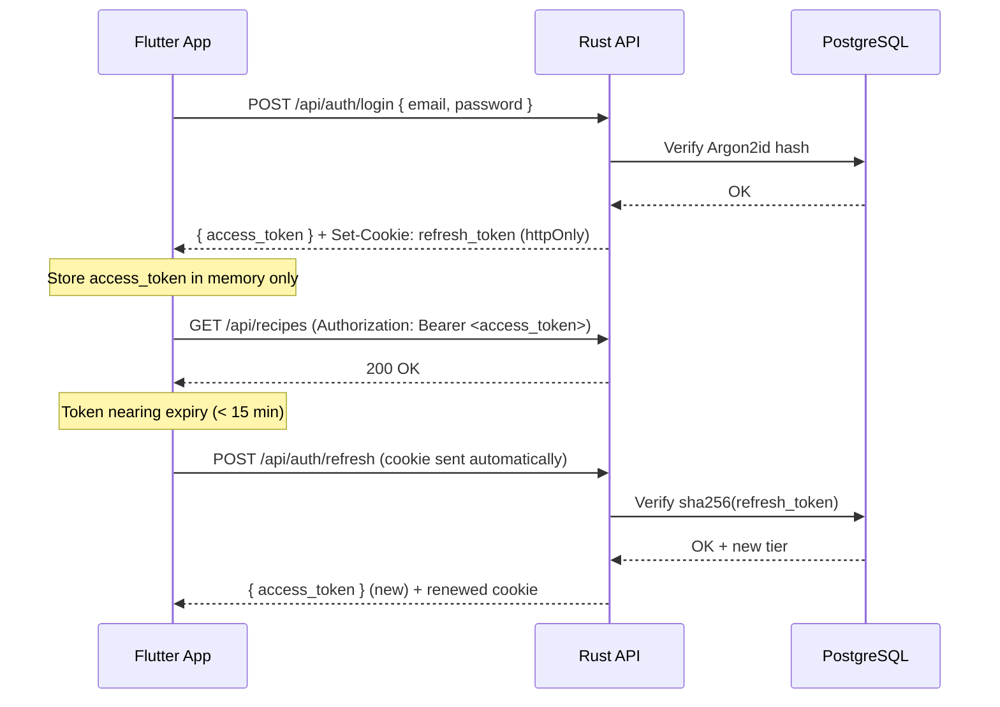

# Autenticação

O Cookest utiliza um **par de tokens JWT de acesso + atualização**. Os tokens de acesso têm curta duração (15 min); os tokens de atualização têm longa duração (30 dias) e são armazenados no servidor como `sha256(token)`.

## Fluxo



## Token Bearer

Todos os endpoints protegidos requerem:

```
Authorization: Bearer <access_token>
```

## Claims do token

```json
{
  "sub": "uuid-of-user",
  "email": "user@example.com",
  "exp": 1234567890,
  "iat": 1234567800,
  "jti": "unique-token-id",
  "tier": "pro",
  "is_admin": false,
  "token_type": "access"
}
```

A claim `tier` permite restringir funcionalidades no lado do cliente sem uma chamada à API extra:

```dart
final payload = JwtDecoder.decode(accessToken);
final tier = payload['tier'] as String; // "free" | "pro" | "family"
if (tier == 'free') showUpgradePrompt();
```

## Registo

```bash
POST /api/auth/register
Content-Type: application/json

{
  "email": "user@example.com",
  "password": "securepassword",
  "name": "Alice"
}
```

Resposta: `201 Created` — utilizador criado mas ainda não configurado.

## Início de sessão

```bash
POST /api/auth/login
Content-Type: application/json

{
  "email": "user@example.com",
  "password": "securepassword"
}
```

Resposta:
```json
{
  "access_token": "eyJ...",
  "token_type": "Bearer",
  "expires_in": 900
}
```
O `refresh_token` é definido automaticamente como cookie httpOnly.

## Atualização

```bash
POST /api/auth/refresh
# Cookie: refresh_token=<token>  (enviado automaticamente pelo browser/Dio)
```

Devolve um novo `access_token`. O cookie de atualização também é renovado.

## Terminar sessão

```bash
POST /api/auth/logout
Authorization: Bearer <access_token>
```

Invalida o token de atualização na base de dados.

## Configuração inicial

Após o registo, complete o perfil do utilizador:

```bash
POST /api/auth/onboarding
Authorization: Bearer <access_token>
Content-Type: application/json

{
  "household_size": 2,
  "dietary_restrictions": ["vegetarian"],
  "allergies": ["nuts"],
  "health_goals": ["weight_loss"],
  "cooking_skill": "intermediate"
}
```

## Modelo de segurança

| Preocupação | Solução |
|---------|----------|
| Armazenamento de palavra-passe | Argon2id (com uso intensivo de memória) |
| Armazenamento do token de atualização | Apenas hash SHA-256 — token em bruto nunca persistido |
| Armazenamento do token de acesso | Apenas memória do cliente — nunca `localStorage` |
| Transporte do token de atualização | Cookie httpOnly — inacessível ao JS |
| Verificação de administrador | Sempre reverificada na BD — claim JWT não é confiada isoladamente |
| Limitação de taxa | Middleware `governor` em todos os endpoints |
