# Esquema da Base de Dados

A API do Cookest utiliza **PostgreSQL 15+** acedido via **SeaORM 1.1**. As migrações são executadas automaticamente no arranque do servidor — todas as operações utilizam `IF NOT EXISTS`, tornando-as seguras para repetição.

## Diagrama ER

```mermaid
erDiagram
    users ||--|| user_preferences : has
    users ||--o{ inventory_items : owns
    users ||--o{ meal_plans : creates
    users ||--o{ user_favorites : saves
    users ||--o{ recipe_ratings : rates
    users ||--o{ cooking_history : cooks
    users ||--o{ chat_sessions : starts
    users ||--o{ shopping_list_items : lists
    users ||--o{ user_push_tokens : registers

    ingredients ||--|| ingredient_nutrients : nutrition
    ingredients ||--o{ portion_sizes : portions
    ingredients ||--o{ recipe_ingredients : used_in
    ingredients ||--o{ inventory_items : tracked_as
    ingredients ||--o{ store_promotion_ingredients : matched

    recipes ||--o{ recipe_ingredients : contains
    recipes ||--o{ recipe_steps : has
    recipes ||--o{ recipe_images : has
    recipes ||--|| recipe_nutrition : nutrition
    recipes ||--o{ user_favorites : favorited
    recipes ||--o{ recipe_ratings : rated
    recipes ||--o{ cooking_history : cooked
    recipes ||--o{ meal_plan_slots : planned

    meal_plans ||--o{ meal_plan_slots : includes

    chat_sessions ||--o{ chat_messages : contains

    stores ||--o{ pdf_processing_jobs : processes
    stores ||--o{ store_promotions : publishes
    stores ||--o{ store_promotion_candidates : stages

    store_promotions ||--o{ store_promotion_ingredients : links
```



---

## Identidade e preferências

### users

Credenciais de conta, perfil, dados de integração e estado da subscrição.

| Coluna | Tipo | Notas |
|--------|------|-------|
| `id` | `UUID` PK | Gerado automaticamente (v4) |
| `email` | `VARCHAR(255)` UNIQUE | Identificador de início de sessão |
| `name` | `VARCHAR(255)` | Nome de apresentação |
| `password_hash` | `TEXT` | Hash bcrypt |
| `refresh_token_hash` | `TEXT` | SHA-256 do token de atualização |
| `household_size` | `INTEGER` | Predefinição `1` — escala porções de receitas |
| `dietary_restrictions` | `TEXT[]` | ex.: `{vegetarian, gluten_free}` |
| `allergies` | `TEXT[]` | ex.: `{shellfish, eggs}` |
| `avatar_url` | `TEXT` | URL da foto de perfil |
| `subscription_tier` | `TEXT` | `free` / `pro` / `family` |
| `subscription_valid_until` | `TIMESTAMPTZ` | Nulo para nível free |
| `stripe_customer_id` | `TEXT` | Referência de cliente Stripe |
| `cooking_skill_level` | `TEXT` | `beginner` / `intermediate` / `advanced` |
| `preferred_cuisines` | `TEXT[]` | Seleções de integração |
| `health_goals` | `TEXT[]` | ex.: `{weight_loss, muscle_gain}` |
| `weekly_budget` | `NUMERIC(10,2)` | Limite de orçamento opcional |
| `preferred_time_per_meal_min` | `INTEGER` | Preferência de tempo máximo de cozedura |
| `onboarding_completed` | `BOOLEAN` | Predefinição `false` |
| `is_admin` | `BOOLEAN` | Verificado via BD, nunca via JWT |
| `is_email_verified` | `BOOLEAN` | Estado de verificação de e-mail |
| `two_factor_enabled` | `BOOLEAN` | Alternância TOTP 2FA |
| `totp_secret` | `TEXT` | Semente TOTP encriptada |
| `failed_login_attempts` | `INTEGER` | Reposto em início de sessão bem-sucedido |
| `locked_until` | `TIMESTAMPTZ` | Expiração de bloqueio de conta |
| `created_at` | `TIMESTAMPTZ` | |
| `updated_at` | `TIMESTAMPTZ` | |

### user_preferences

Vetores de preferência de IA por utilizador, atualizados incrementalmente via descida de gradiente online (taxa de aprendizagem 0.01).

| Coluna | Tipo | Notas |
|--------|------|-------|
| `user_id` | `UUID` PK, FK → users | Um-para-um com users |
| `cuisine_weights` | `JSONB` | ex.: `{"italian": 0.8, "japanese": 0.3}` |
| `ingredient_weights` | `JSONB` | Pontuações de afinidade por ingrediente |
| `macro_bias` | `JSONB` | `{"protein": 0.0, "carbs": 0.0, "fat": 0.0}` |
| `difficulty_weights` | `JSONB` | `{"easy": 0.0, "medium": 0.0, "hard": 0.0}` |
| `preferred_time_min` | `INTEGER` | Predefinição `30` |
| `interaction_count` | `INTEGER` | Total de avaliações + cozinhados |
| `updated_at` | `TIMESTAMPTZ` | |

---

## Ingredientes e nutrição

### ingredients

Catálogo principal de ingredientes, alimentado pelo pipeline ETL a partir do FoodData Central e Open Food Facts.

| Coluna | Tipo | Notas |
|--------|------|-------|
| `id` | `BIGSERIAL` PK | |
| `name` | `TEXT` UNIQUE | Nome canónico |
| `category` | `TEXT` | ex.: `dairy`, `vegetable` |
| `fdc_id` | `INTEGER` | ID do FoodData Central (indexado) |
| `off_id` | `TEXT` | ID do Open Food Facts |
| `created_at` | `TIMESTAMPTZ` | |

### ingredient_nutrients

Valores detalhados de macro e micronutrientes por 100 g de ingrediente. Um-para-um com ingredients.

| Coluna | Tipo | Notas |
|--------|------|-------|
| `id` | `BIGSERIAL` PK | |
| `ingredient_id` | `BIGINT` FK → ingredients | UNIQUE — uma linha por ingrediente |
| `calories` | `NUMERIC(10,4)` | kcal por 100 g |
| `protein_g` | `NUMERIC(10,4)` | |
| `carbs_g` | `NUMERIC(10,4)` | |
| `fat_g` | `NUMERIC(10,4)` | |
| `fiber_g` | `NUMERIC(10,4)` | |
| `sugar_g` | `NUMERIC(10,4)` | |
| `sodium_mg` | `NUMERIC(10,4)` | |
| `saturated_fat_g` | `NUMERIC(10,4)` | |
| `cholesterol_mg` | `NUMERIC(10,4)` | |
| `micronutrients` | `JSONB` | Indexado com GIN para consultas flexíveis |

### portion_sizes

Tamanhos de porções comuns por ingrediente (ex.: "1 ovo médio = 50 g").

| Coluna | Tipo | Notas |
|--------|------|-------|
| `id` | `BIGSERIAL` PK | |
| `ingredient_id` | `BIGINT` FK → ingredients | |
| `description` | `TEXT` | ex.: "1 médio" |
| `weight_grams` | `NUMERIC(10,3)` | |
| `unit` | `TEXT` | ex.: "chávena", "colher de sopa" |

---

## Receitas

### recipes

Metadados de receitas. Suporta filtros alimentares, pesquisa de texto completo (índice GIN trigram em `name`) e autoria por utilizador.

| Coluna | Tipo | Notas |
|--------|------|-------|
| `id` | `BIGSERIAL` PK | |
| `name` | `TEXT` | Indexado com trigram GIN |
| `slug` | `TEXT` UNIQUE | Identificador seguro para URL |
| `description` | `TEXT` | |
| `cuisine` | `TEXT` | Indexado |
| `category` | `TEXT` | Indexado |
| `difficulty` | `TEXT` | Indexado — `easy` / `medium` / `hard` |
| `servings` | `INTEGER` | Predefinição `2` |
| `prep_time_min` | `INTEGER` | |
| `cook_time_min` | `INTEGER` | |
| `total_time_min` | `INTEGER` | |
| `is_vegetarian` | `BOOLEAN` | Índice alimentar composto |
| `is_vegan` | `BOOLEAN` | |
| `is_gluten_free` | `BOOLEAN` | |
| `is_dairy_free` | `BOOLEAN` | |
| `is_nut_free` | `BOOLEAN` | |
| `source_url` | `TEXT` | URL da receita original |
| `average_rating` | `NUMERIC(3,2)` | Média desnormalizada |
| `rating_count` | `INTEGER` | |
| `author_id` | `UUID` FK → users | Anulável — receitas submetidas por utilizadores |
| `is_public` | `BOOLEAN` | Predefinição `true` |
| `created_at` | `TIMESTAMPTZ` | |
| `updated_at` | `TIMESTAMPTZ` | |

### recipe_ingredients

Tabela de junção entre receitas e ingredientes com quantidade e unidade.

| Coluna | Tipo | Notas |
|--------|------|-------|
| `id` | `BIGSERIAL` PK | |
| `recipe_id` | `BIGINT` FK → recipes | ON DELETE CASCADE |
| `ingredient_id` | `BIGINT` FK → ingredients | ON DELETE RESTRICT |
| `quantity` | `NUMERIC(10,3)` | ex.: `200` |
| `unit` | `TEXT` | ex.: `g`, `ml`, `colher de sopa` |
| `quantity_grams` | `NUMERIC(10,3)` | Peso normalizado para cálculo nutricional |
| `notes` | `TEXT` | ex.: "finamente picado" |
| `display_order` | `INTEGER` | Sequência de apresentação |

### recipe_steps

Instruções de confeção ordenadas para uma receita.

| Coluna | Tipo | Notas |
|--------|------|-------|
| `id` | `BIGSERIAL` PK | |
| `recipe_id` | `BIGINT` FK → recipes | |
| `step_number` | `INTEGER` | UNIQUE por receita |
| `instruction` | `TEXT` | Texto do passo |
| `duration_min` | `INTEGER` | Estimativa de tempo opcional |
| `image_url` | `TEXT` | Foto do passo opcional |
| `tip` | `TEXT` | Dica de cozinha opcional |

### recipe_images

URLs de imagens associadas a receitas.

| Coluna | Tipo | Notas |
|--------|------|-------|
| `id` | `BIGSERIAL` PK | |
| `recipe_id` | `BIGINT` FK → recipes | |
| `url` | `TEXT` | URL da imagem |
| `image_type` | `TEXT` | ex.: `hero`, `step` |
| `is_primary` | `BOOLEAN` | Predefinição `false` |
| `width` | `INTEGER` | |
| `height` | `INTEGER` | |
| `source` | `TEXT` | Atribuição |
| `created_at` | `TIMESTAMPTZ` | |

### recipe_nutrition

Totais de macros pré-calculados para uma receita. Um-para-um com recipes.

| Coluna | Tipo | Notas |
|--------|------|-------|
| `id` | `BIGSERIAL` PK | |
| `recipe_id` | `BIGINT` FK → recipes | UNIQUE |
| `per_serving` | `BOOLEAN` | Predefinição `true` — valores são por porção |
| `calories` | `NUMERIC(10,4)` | |
| `protein_g` | `NUMERIC(10,4)` | |
| `carbs_g` | `NUMERIC(10,4)` | |
| `fat_g` | `NUMERIC(10,4)` | |
| `fiber_g` | `NUMERIC(10,4)` | |
| `sugar_g` | `NUMERIC(10,4)` | |
| `sodium_mg` | `NUMERIC(10,4)` | |
| `saturated_fat_g` | `NUMERIC(10,4)` | |
| `cholesterol_mg` | `NUMERIC(10,4)` | |
| `micronutrients` | `JSONB` | |
| `calculated_at` | `TIMESTAMPTZ` | |

---

## Interações do utilizador

### user_favorites

Receitas guardadas/marcadas por utilizador.

| Coluna | Tipo | Notas |
|--------|------|-------|
| `id` | `BIGSERIAL` PK | |
| `user_id` | `UUID` FK → users | UNIQUE(user_id, recipe_id) |
| `recipe_id` | `BIGINT` FK → recipes | |
| `saved_at` | `TIMESTAMPTZ` | |

### recipe_ratings

Avaliações de 1 a 5 estrelas com comentário de texto opcional.

| Coluna | Tipo | Notas |
|--------|------|-------|
| `id` | `BIGSERIAL` PK | |
| `user_id` | `UUID` FK → users | UNIQUE(user_id, recipe_id) |
| `recipe_id` | `BIGINT` FK → recipes | |
| `rating` | `SMALLINT` | CHECK 1–5 |
| `comment` | `TEXT` | |
| `created_at` | `TIMESTAMPTZ` | |
| `updated_at` | `TIMESTAMPTZ` | |

### cooking_history

Registo datado de cada vez que um utilizador cozinha uma receita. Desencadeia dedução automática de inventário.

| Coluna | Tipo | Notas |
|--------|------|-------|
| `id` | `BIGSERIAL` PK | |
| `user_id` | `UUID` FK → users | |
| `recipe_id` | `BIGINT` FK → recipes | |
| `servings_made` | `INTEGER` | Predefinição `1` |
| `inventory_deducted` | `BOOLEAN` | Predefinição `false` — definido `true` após dedução |
| `cooked_at` | `TIMESTAMPTZ` | |

---

## Planeamento e inventário

### inventory_items

Itens da despensa com quantidade, unidade, data de validade e localização de armazenamento.

| Coluna | Tipo | Notas |
|--------|------|-------|
| `id` | `BIGSERIAL` PK | |
| `user_id` | `UUID` FK → users | |
| `ingredient_id` | `BIGINT` FK → ingredients | ON DELETE RESTRICT |
| `custom_name` | `TEXT` | Nome de apresentação alternativo opcional |
| `quantity` | `NUMERIC(10,3)` | |
| `unit` | `TEXT` | ex.: `g`, `ml`, `unidades` |
| `expiry_date` | `DATE` | Indexado para alertas de validade |
| `storage_location` | `TEXT` | `fridge` / `freezer` / `pantry` / `other` |
| `added_at` | `TIMESTAMPTZ` | |
| `updated_at` | `TIMESTAMPTZ` | |

### meal_plans

Contentor do plano semanal. Um plano por utilizador por semana.

| Coluna | Tipo | Notas |
|--------|------|-------|
| `id` | `BIGSERIAL` PK | |
| `user_id` | `UUID` FK → users | UNIQUE(user_id, week_start) |
| `week_start` | `DATE` | Segunda-feira da semana do plano |
| `is_ai_generated` | `BOOLEAN` | Predefinição `false` |
| `created_at` | `TIMESTAMPTZ` | |
| `updated_at` | `TIMESTAMPTZ` | |

### meal_plan_slots

Atribuições individuais de refeições: dia 0–6 × tipo de refeição. Suporta dias flex/de descanso.

| Coluna | Tipo | Notas |
|--------|------|-------|
| `id` | `BIGSERIAL` PK | |
| `meal_plan_id` | `BIGINT` FK → meal_plans | |
| `recipe_id` | `BIGINT` FK → recipes | Anulável — nulo para dias flex |
| `day_of_week` | `SMALLINT` | CHECK 0–6 (Seg–Dom) |
| `meal_type` | `TEXT` | `breakfast` / `lunch` / `dinner` / `snack` |
| `servings_override` | `INTEGER` | Substitui predefinição da receita |
| `is_completed` | `BOOLEAN` | Predefinição `false` |
| `is_flex` | `BOOLEAN` | Predefinição `false` — indicador de dia de descanso |
| `flex_type` | `TEXT` | `effort` / `nutrition` / `mental` / `social` |
| `energy_level` | `TEXT` | Rastreio de energia opcional |

<Callout type="info">
A restrição UNIQUE em `(meal_plan_id, day_of_week, meal_type)` garante no máximo uma receita por slot.
</Callout>

### shopping_list_items

Itens da lista de compras do utilizador, opcionalmente ligados a um plano de refeições para sincronização automática.

| Coluna | Tipo | Notas |
|--------|------|-------|
| `id` | `UUID` PK | |
| `user_id` | `UUID` FK → users | |
| `ingredient_id` | `BIGINT` FK → ingredients | Anulável — para itens manuais |
| `name` | `TEXT` | Nome de apresentação |
| `quantity` | `NUMERIC(10,3)` | |
| `unit` | `TEXT` | |
| `is_checked` | `BOOLEAN` | Predefinição `false` |
| `is_manual` | `BOOLEAN` | `true` se adicionado manualmente vs. sincronizado |
| `meal_plan_id` | `BIGINT` FK → meal_plans | Anulável — liga ao plano de origem |
| `created_at` | `TIMESTAMPTZ` | |
| `updated_at` | `TIMESTAMPTZ` | |

---

## Chat com IA

### chat_sessions

Uma sessão por fio de conversa, opcionalmente contextualizada a uma receita (chat do Modo de Cozinha).

| Coluna | Tipo | Notas |
|--------|------|-------|
| `id` | `BIGSERIAL` PK | |
| `user_id` | `UUID` FK → users | |
| `current_recipe_id` | `BIGINT` FK → recipes | Anulável — fornece contexto de receita |
| `title` | `TEXT` | Gerado automaticamente ou definido pelo utilizador |
| `created_at` | `TIMESTAMPTZ` | |
| `updated_at` | `TIMESTAMPTZ` | |

### chat_messages

Mensagens individuais dentro de uma sessão de chat.

| Coluna | Tipo | Notas |
|--------|------|-------|
| `id` | `BIGSERIAL` PK | |
| `session_id` | `BIGINT` FK → chat_sessions | Indexado com `created_at` ASC |
| `role` | `TEXT` | CHECK `user` / `assistant` / `system` |
| `content` | `TEXT` | Corpo da mensagem |
| `tokens_used` | `INTEGER` | Contagem de tokens LLM para limitação de taxa |
| `created_at` | `TIMESTAMPTZ` | |

---

## Lojas e promoções

### stores

Lojas cujos folhetos promocionais são processados pelo pipeline de PDFs.

| Coluna | Tipo | Notas |
|--------|------|-------|
| `id` | `UUID` PK | |
| `name` | `TEXT` | Nome da loja |
| `slug` | `TEXT` UNIQUE | Identificador seguro para URL |
| `website` | `TEXT` | |
| `logo_url` | `TEXT` | |
| `country` | `TEXT` | |
| `city` | `TEXT` | |
| `created_at` | `TIMESTAMPTZ` | |
| `updated_at` | `TIMESTAMPTZ` | |

### pdf_processing_jobs

Rastreia o estado dos trabalhos de processamento de folhetos PDF.

| Coluna | Tipo | Notas |
|--------|------|-------|
| `id` | `UUID` PK | |
| `store_id` | `UUID` FK → stores | |
| `file_path` | `TEXT` | Caminho do PDF carregado |
| `status` | `TEXT` | `pending` / `processing` / `completed` / `failed` |
| `error` | `TEXT` | Mensagem de erro em caso de falha |
| `retry_count` | `INTEGER` | Predefinição `0` |
| `started_at` | `TIMESTAMPTZ` | |
| `heartbeat_at` | `TIMESTAMPTZ` | Verificação de atividade para trabalhos longos |
| `processed_at` | `TIMESTAMPTZ` | |
| `created_at` | `TIMESTAMPTZ` | |

### store_promotions

Preços promocionais em tempo real extraídos de PDFs processados e aprovados pelo administrador.

| Coluna | Tipo | Notas |
|--------|------|-------|
| `id` | `UUID` PK | |
| `store_id` | `UUID` FK → stores | |
| `product_name` | `TEXT` | Nome do produto extraído do PDF |
| `brand` | `TEXT` | |
| `original_price` | `NUMERIC(10,2)` | |
| `discounted_price` | `NUMERIC(10,2)` | |
| `discount_pct` | `NUMERIC(5,2)` | |
| `unit` | `TEXT` | ex.: `kg`, `unidade` |
| `valid_from` | `TIMESTAMPTZ` | Janela da promoção |
| `valid_until` | `TIMESTAMPTZ` | |
| `is_active` | `BOOLEAN` | Predefinição `true` |
| `source_pdf_url` | `TEXT` | |
| `confidence` | `NUMERIC(4,3)` | Confiança de extração LLM 0–1 |
| `created_at` | `TIMESTAMPTZ` | |
| `updated_at` | `TIMESTAMPTZ` | |

### store_promotion_ingredients

Liga promoções a ingredientes no catálogo usando correspondência por semelhança.

| Coluna | Tipo | Notas |
|--------|------|-------|
| `promotion_id` | `UUID` FK → store_promotions | PK composta |
| `ingredient_id` | `BIGINT` FK → ingredients | PK composta |
| `similarity_score` | `NUMERIC(4,3)` | Confiança de correspondência 0–1 |

### store_promotion_candidates

Tabela de preparação para promoções extraídas de PDFs, pendentes de revisão do administrador.

| Coluna | Tipo | Notas |
|--------|------|-------|
| `id` | `UUID` PK | |
| `store_id` | `UUID` FK → stores | |
| `job_id` | `UUID` FK → pdf_processing_jobs | Trabalho de processamento de origem |
| `product_name` | `TEXT` | |
| `brand` | `TEXT` | |
| `original_price` | `NUMERIC(10,2)` | |
| `discounted_price` | `NUMERIC(10,2)` | |
| `discount_pct` | `NUMERIC(5,2)` | |
| `unit` | `TEXT` | |
| `valid_from` | `TIMESTAMPTZ` | |
| `valid_until` | `TIMESTAMPTZ` | |
| `confidence` | `NUMERIC(4,3)` | |
| `review_status` | `TEXT` | `pending` / `approved` / `rejected` |
| `reviewed_by` | `UUID` FK → users | Administrador que reviu |
| `reviewed_at` | `TIMESTAMPTZ` | |
| `created_at` | `TIMESTAMPTZ` | |

---

## Notificações push e pagamentos

### user_push_tokens

Tokens push de dispositivos para notificações.

| Coluna | Tipo | Notas |
|--------|------|-------|
| `id` | `UUID` PK | |
| `user_id` | `UUID` FK → users | |
| `token` | `TEXT` UNIQUE | Token do dispositivo |
| `platform` | `TEXT` | `ios` / `android` / `web` |
| `created_at` | `TIMESTAMPTZ` | |

### stripe_processed_events

Tabela de idempotência para processamento de webhooks Stripe — previne tratamento duplicado de eventos.

| Coluna | Tipo | Notas |
|--------|------|-------|
| `event_id` | `TEXT` PK | ID do evento Stripe |
| `processed_at` | `TIMESTAMPTZ` | |

---

## Relações principais

```mermaid
erDiagram
    recipes ||--o{ recipe_ingredients : contains
    recipe_ingredients }o--|| ingredients : references
    recipes ||--o{ recipe_steps : has
    recipes ||--|| recipe_nutrition : totals

    users ||--o{ cooking_history : cooks
    cooking_history }o--|| recipes : of
    cooking_history ..|| inventory_items : "auto-deducts"

    users ||--o{ meal_plans : creates
    meal_plans ||--o{ meal_plan_slots : includes
    meal_plan_slots }o--o| recipes : assigns

    meal_plans ||--o{ shopping_list_items : syncs

    stores ||--o{ pdf_processing_jobs : processes
    pdf_processing_jobs ||--o{ store_promotion_candidates : extracts
    store_promotion_candidates ..|| store_promotions : "approved →"
    store_promotions ||--o{ store_promotion_ingredients : matches
    store_promotion_ingredients }o--|| ingredients : links
```

- **`recipe_ingredients`** liga receitas a ingredientes, armazenando `quantity` e `unit` (ex.: 200 g). A coluna `quantity_grams` contém o peso normalizado usado para cálculo nutricional.
- **`meal_plan_slots`** associa planos semanais a receitas específicas e controla `is_flex`, `flex_type`, `is_completed` e `servings_override`.
- **`cooking_history`** desencadeia deduções automáticas de inventário escaladas pelo `household_size` quando `inventory_deducted` transita de `false` para `true`.
- **`user_preferences`** armazena vetores de peso em vírgula flutuante que o algoritmo de aprendizagem online atualiza de forma incremental com cada avaliação ou evento de cozedura.
- **`store_promotion_candidates`** → **`store_promotions`** — as promoções passam por revisão de administrador antes de ficarem ativas.
- **`stripe_processed_events`** garante idempotência de webhooks — cada evento Stripe é processado exatamente uma vez.

## Fonte de verdade

<Callout type="info">
O SQL de migração em `api/src/main.rs` é o esquema canónico. Este documento reflete esse esquema — consulte o ficheiro fonte para tipos de colunas e restrições exatas.
</Callout>
