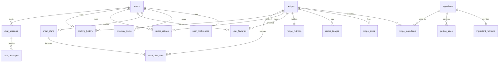

# Esquema da Base de Dados

A API do Cookest utiliza **PostgreSQL 15+** acedido via **SeaORM 1.1**. As migrações são executadas automaticamente no arranque do servidor — todas as operações utilizam `IF NOT EXISTS`, tornando-as seguras para repetição.

## Grupos de entidades

### Identidade e preferências
- `users` — credenciais de conta e perfil
- `user_preferences` — vetores de peso de preferências de IA por utilizador (culinária, ingrediente, dificuldade)

### Ingredientes e nutrição
- `ingredients` — catálogo principal de ingredientes com metadados nutricionais
- `ingredient_nutrients` — valores detalhados de macro e micronutrientes
- `portion_sizes` — tamanhos de porções comuns por ingrediente

### Receitas
- `recipes` — metadados de receitas (título, descrição, culinária, dificuldade, tempos)
- `recipe_ingredients` — tabela de junção entre receitas e ingredientes com quantidade/unidade
- `recipe_steps` — instruções de confeção ordenadas
- `recipe_images` — URLs de imagens associadas às receitas
- `recipe_nutrition` — totais de macros pré-calculados para uma receita

### Interações do utilizador
- `user_favorites` — receitas guardadas/marcadas por utilizador
- `recipe_ratings` — avaliações de 1 a 5 estrelas com notas opcionais
- `cooking_history` — registo datado de cada vez que um utilizador cozinha uma receita (desencadeia deduções no inventário)

### Planeamento e inventário
- `inventory_items` — itens da despensa com quantidade, unidade, data de validade e localização
- `meal_plans` — contentor do plano semanal (data de início da semana)
- `meal_plan_slots` — atribuições individuais de refeições: dia 0–6 × tipo de refeição (pequeno-almoço/almoço/jantar/lanche)

### Subscrições e pagamentos
- `subscriptions` — ID de subscrição Stripe, nível, estado, valid_until
- `store_promotions` — dados de preços em tempo real a partir de PDFs processados
- `store_promotion_candidates` — tabela de preparação para revisão do administrador antes de publicação

### Chat com IA
- `chat_sessions` — uma sessão por fio de conversa
- `chat_messages` — mensagens individuais com role (utilizador/assistente) e conteúdo

### Notificações push
- `push_tokens` — tokens push de dispositivos (ios/android/web)

## Diagrama ER

## Relações principais

- **`recipe_ingredients`** liga receitas a ingredientes, armazenando `quantity` e `unit` (ex.: 200 g).
- **`meal_plan_slots`** associa planos semanais a receitas específicas e controla `is_flex`, `flex_type`, `is_completed` e `servings_override`.
- **`cooking_history`** desencadeia deduções automáticas de inventário escaladas pelo `household_size`.
- **`user_preferences`** armazena vetores de peso em vírgula flutuante que o algoritmo de aprendizagem online atualiza de forma incremental.

## Fonte de verdade

<Callout type="info">
O SQL de migração em `api/src/main.rs` é o esquema canónico. Este documento reflete esse esquema — consulte o ficheiro fonte para tipos de colunas e restrições exatas.
</Callout>
