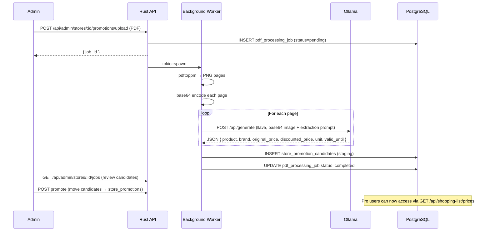

# Pipeline de Extração de Preços em PDF

O Cookest inclui um pipeline exclusivo de administrador que extrai preços de produtos a partir de folhetos promocionais semanais de supermercados e os disponibiliza aos utilizadores Pro através do otimizador de lista de compras.

## Visão geral do pipeline



## Requisitos

```bash
# macOS
brew install poppler

# Debian/Ubuntu
sudo apt install poppler-utils

# Descarregar o modelo de visão
ollama pull llava
```

## Endpoints de administrador

| Método | Caminho | Descrição |
|--------|------|-------------|
| `POST` | `/api/admin/stores` | Criar um novo registo de loja |
| `POST` | `/api/admin/stores/:id/promotions/upload` | Enviar PDF de promoções semanais |
| `GET` | `/api/admin/stores/:id/jobs` | Verificar o estado do trabalho |

Todos os endpoints de administrador requerem um JWT com `is_admin: true` verificado na base de dados (não apenas na claim do token).

## Prompt de extração

O modelo de visão recebe um prompt estruturado pedindo-lhe que extraia:
- Nome do produto e marca
- Preço original e preço com desconto
- Unidade (por kg, por unidade, por litro, etc.)
- Datas de validade da promoção

A resposta é analisada como JSON e inserida em `store_promotion_candidates` para revisão do administrador antes de ser publicada.

## Acesso de utilizadores Pro

Após a publicação das promoções, os utilizadores Pro podem:
- `GET /api/shopping-list/prices` — preços atuais para todos os itens na sua lista de compras
- `GET /api/shopping-list/optimize` — divisão mais barata por loja única e por múltiplas lojas

<Callout type="info">
Os dados de preços são específicos de cada loja e baseados em promoções — não são um feed de preços em tempo real. Os preços refletem o folheto semanal mais recentemente carregado para cada loja.
</Callout>
