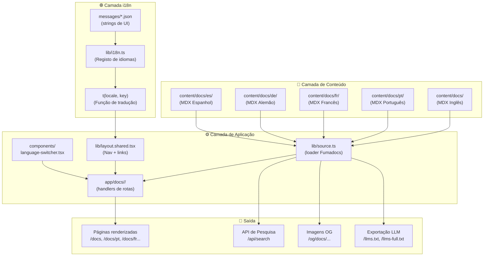

# Arquitetura da Documentação

Esta página descreve a arquitetura interna do próprio site de documentação do Cookest — como é construído, como as traduções funcionam e como adicionar novo conteúdo ou idiomas.

## Pilha Tecnológica

| Camada | Tecnologia | Propósito |
|--------|-----------|---------|
| Framework | Next.js 16 (App Router) | SSG + roteamento |
| Motor de docs | Fumadocs 16.8 | Conteúdo MDX, barra lateral, pesquisa |
| Estilização | TailwindCSS 4 | Componentes de UI |
| Diagramas | Mermaid | Diagramas de arquitetura/fluxo |
| i18n (conteúdo) | Parser de diretório Fumadocs | Ficheiros MDX por idioma |
| i18n (strings de UI) | JSON personalizado + função `t()` | Navegação, botões, etiquetas |
| Ícones | Lucide React | Ícones de navegação |

## Arquitetura de Alto Nível



## Estrutura de Pastas

```
docs/
├── content/docs/                    ← Conteúdo MDX (Inglês = padrão)
│   ├── index.mdx                    ← Página de entrada raiz
│   ├── architecture/                ← Docs de design de sistema
│   ├── backend/                     ← Documentação da API
│   ├── mobile/                      ← Docs da aplicação Flutter
│   ├── user-guide/                  ← Tutoriais para utilizadores finais
│   ├── etl/                         ← Docs do pipeline de dados
│   ├── contributing/                ← Esta secção
│   ├── ai/                          ← Docs de IA e automação
│   ├── pt/                          ← 🇵🇹 Português (Tier 1 — paridade total)
│   ├── fr/                          ← 🇫🇷 Francês (Tier 2 — comunidade)
│   ├── de/                          ← 🇩🇪 Alemão (Tier 2 — comunidade)
│   └── es/                          ← 🇪🇸 Espanhol (Tier 2 — comunidade)
├── messages/                        ← Ficheiros JSON de tradução para strings de UI
│   ├── en.json
│   ├── pt.json
│   ├── fr.json
│   ├── de.json
│   └── es.json
├── lib/
│   ├── i18n.ts                      ← Registo central de idiomas + função t()
│   ├── source.ts                    ← Loader de conteúdo Fumadocs
│   ├── layout.shared.tsx            ← Configuração de nav com reconhecimento de idioma
│   └── shared.ts                    ← Constantes (rotas, config git)
├── components/
│   ├── language-switcher.tsx        ← Dropdown de múltiplos idiomas
│   ├── mdx.tsx                      ← Substituições de componentes MDX
│   └── mermaid.tsx                  ← Renderizador de diagramas Mermaid
├── app/
│   ├── docs/
│   │   ├── (en)/                    ← Rotas em inglês (padrão, sem prefixo)
│   │   ├── pt/                      ← Rotas em português (/docs/pt/...)
│   │   ├── fr/                      ← Rotas em francês (/docs/fr/...)
│   │   ├── de/                      ← Rotas em alemão (/docs/de/...)
│   │   └── es/                      ← Rotas em espanhol (/docs/es/...)
│   ├── api/search/                  ← API de pesquisa de texto completo
│   └── og/docs/                     ← Geração de imagens OpenGraph
└── messages/                        ← Traduções de strings de UI
```

## Sistema i18n

A documentação usa um **sistema i18n de duas camadas**:

### Camada 1: Conteúdo (ficheiros MDX)

O Fumadocs trata a tradução de conteúdo através do seu **parser de diretório**. Os ficheiros estão organizados por idioma:

- `content/docs/*.mdx` → Inglês (idioma padrão)
- `content/docs/pt/*.mdx` → Português
- `content/docs/fr/*.mdx` → Francês
- etc.

O loader em `lib/source.ts` configura isto:

```typescript
i18n: {
  defaultLanguage: 'en',
  languages: ['en', 'pt', 'fr', 'de', 'es'],
  parser: 'dir',
  fallbackLanguage: null,  // 404 se a tradução faltar
}
```

### Camada 2: Strings de UI (ficheiros JSON)

Etiquetas de navegação, botões e outros elementos de UI são traduzidos via ficheiros JSON em `messages/`. A função `t()` em `lib/i18n.ts` fornece acesso com tipos:

```typescript
import { t } from '@/lib/i18n';

t('en', 'nav.docs')           // "Docs"
t('pt', 'nav.docs')           // "Documentação"
t('fr', 'common.nextPage')    // "Suivant"
```

### Tiers de Idioma

| Tier | Idiomas | Cobertura | Manutenção |
|------|---------|----------|------------|
| **Tier 1** | 🇬🇧 EN, 🇵🇹 PT | Paridade total — todas as páginas traduzidas | Equipa principal |
| **Tier 2** | 🇫🇷 FR, 🇩🇪 DE, 🇪🇸 ES | Páginas de índice/destino + conteúdo de alto tráfego | Comunidade |

Os idiomas Tier 2 mostram um **crachá β** no seletor de idioma e um **banner de aviso de tradução** em cada página.

## Roteamento de URLs

| Padrão de URL | Idioma | Handler de Rota |
|---------------|--------|----------------|
| `/docs/...` | Inglês | `app/docs/(en)/[[...slug]]/page.tsx` |
| `/docs/pt/...` | Português | `app/docs/pt/[[...slug]]/page.tsx` |
| `/docs/fr/...` | Francês | `app/docs/fr/[[...slug]]/page.tsx` |
| `/docs/de/...` | Alemão | `app/docs/de/[[...slug]]/page.tsx` |
| `/docs/es/...` | Espanhol | `app/docs/es/[[...slug]]/page.tsx` |

O inglês é o idioma padrão e não tem prefixo de URL (usa um grupo de rotas Next.js `(en)`).

## Adicionar um Novo Idioma

Ver o [Guia de Contribuição de Traduções](/docs/contributing/translations) para o processo passo a passo completo.
