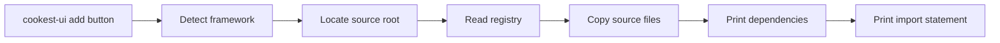

# CLI — `cookest-ui`

`@cookest/ui-cli` is a **shadcn-style command-line tool** that copies Cookest UI component source files directly into your React or Flutter project. You own the files — no symlinks, no monorepo setup required.

```bash
npx @cookest/ui-cli add button
```

---

## Installation

**Use without installing (recommended):**

```bash
npx @cookest/ui-cli <command>
```

**Install globally:**

```bash
npm install -g @cookest/ui-cli
# or
bun add -g @cookest/ui-cli
```

---

## Quick Start

### React project

```bash
# 1. Initialize (auto-detects React from package.json)
npx @cookest/ui-cli init

# 2. Add components
npx @cookest/ui-cli add button input card
```

Files are copied to `src/components/ui/`. Install the printed dependencies and import:

```tsx
import { Button } from "@/components/ui/Button";
```

### Flutter project

```bash
# Auto-detected from pubspec.yaml, or use --flutter
npx @cookest/ui-cli add button --flutter
```

Files are copied to `lib/ui/`. The CLI prints the `pubspec.yaml` snippet for any missing dependencies:

```yaml
dependencies:
  google_fonts: ^8.0.0
```

```bash
flutter pub get
```

```dart
import 'lib/ui/ck_button.dart';
```

---

## Commands

### `init`

Detects your framework, locates the Cookest UI source, and creates a `.cookestrc` config file in your project root.

```bash
npx @cookest/ui-cli init
npx @cookest/ui-cli init --yes   # skip prompts
```

**Generated `.cookestrc`:**

```json
{
  "framework": "react",
  "sourceRoot": "../../ui-components",
  "componentsDir": "src/components/ui"
}
```

| Field | Description |
|---|---|
| `framework` | `"react"` or `"flutter"` |
| `sourceRoot` | Path to `ui-components/` relative to `.cookestrc` |
| `componentsDir` | React: where `.tsx` files are copied |
| `libDir` | Flutter: where `.dart` files are copied |

---

### `list`

Shows all available components with React/Flutter availability and descriptions.

```bash
npx @cookest/ui-cli list

# Filter by name, tag, or description
npx @cookest/ui-cli list --filter form
npx @cookest/ui-cli list --filter loading
```

**Example output:**

```
🌿 Cookest UI — Available Components

  Name        React  Flutter  Description
  ──────────────────────────────────────────────────────────────────────
  button        ✔      ✔      Pressable button with variants, loading state...
  input         ✔      ✔      Text input with label, error, helper text...
  slider        ✔      ✔      Range slider with marks, color variants...
  ...

  Total: 18 components
  Usage: cookest-ui add <component>
```

---

### `add`

Copies component source files into your project and prints the import statement.

```bash
# Add one component
npx @cookest/ui-cli add button

# Add multiple
npx @cookest/ui-cli add button input card badge

# Interactive picker (no args — opens a multi-select prompt)
npx @cookest/ui-cli add

# Add all 18 components
npx @cookest/ui-cli add --all

# Force React or Flutter (overrides auto-detection)
npx @cookest/ui-cli add tabs --react
npx @cookest/ui-cli add tabs --flutter

# Overwrite existing files
npx @cookest/ui-cli add button --overwrite
```

**React output example:**

```
🌿 Adding 1 component (react)

  Adding button...
    ✔ src/components/ui/Button.tsx
    ✔ src/components/ui/Button/index.ts

  Run to install dependencies:
  bun add framer-motion

  Import in your project:
  import { Button } from '@/components/ui/Button';

  ✔ Done!
```

**Flutter output example:**

```
🌿 Adding 1 component (flutter)

  Adding button...
    ✔ lib/ui/ck_button.dart

  Add to pubspec.yaml dependencies:
    google_fonts: ^8.0.0
  Then run: flutter pub get

  Import in your Dart file:
  import 'lib/ui/ck_button.dart';

  ✔ Done!
```

---

### `diff`

Compares locally installed component files against the registry source. Useful after upgrading `@cookest/ui-cli` to find components that have been updated.

```bash
# Check all installed components
npx @cookest/ui-cli diff

# Check specific components
npx @cookest/ui-cli diff button card tabs

# Check Flutter widgets
npx @cookest/ui-cli diff --flutter
```

**Output when components are outdated:**

```
🌿 Diffing 3 components (react)

  ~ button: src/components/ui/Button.tsx differs from source
      source: src/components/Button/Button.tsx
      Run `cookest-ui add --overwrite` to update.

  ✔ card — up to date
  ✔ tabs — up to date
```

---

## Available Components

All 18 components are available in both React and Flutter:

| Component | Tags | React import | Flutter widget |
|---|---|---|---|
| `button` | action, form | `Button` | `CkButton` |
| `input` | form, text | `Input` | `CkInput` |
| `textarea` | form, multiline | `Textarea` | `CkTextarea` |
| `card` | layout, container | `Card` | `CkCard` |
| `badge` | label, status | `Badge` | `CkBadge` |
| `avatar` | user, profile | `Avatar` | `CkAvatar` |
| `modal` | overlay, dialog | `Modal` | `CkModal` |
| `tooltip` | overlay, info | `Tooltip` | `CkTooltip` |
| `toggle` | form, switch | `Toggle` | `CkToggle` |
| `select` | form, dropdown | `Select` | `CkSelect` |
| `skeleton` | loading, state | `Skeleton` | `CkSkeleton` |
| `alert` | feedback, banner | `Alert` | `CkAlert` |
| `divider` | layout | `Divider` | `CkDivider` |
| `slider` | form, range | `Slider` | `CkSlider` |
| `progress` | loading, feedback | `Progress` | `CkProgress` |
| `spinner` | loading, animation | `Spinner` | `CkSpinner` |
| `tabs` | navigation | `Tabs` | `CkTabs` |
| `accordion` | layout, disclosure | `Accordion` | `CkAccordion` |

---

## Framework Detection

The CLI walks up your directory tree looking for project markers:

| File found | Detected framework |
|---|---|
| `pubspec.yaml` with `sdk: flutter` | Flutter |
| `package.json` with `react` or `next` dep | React |
| `package.json` only | React (generic) |

Always override with `--react` or `--flutter` flags.

---

## Monorepo Setup

If you work inside the Cookest monorepo, run `cookest-ui init` once. The CLI auto-discovers `ui-components/` by walking up the directory tree. The resulting `.cookestrc` stores the relative path:

```json
{
  "framework": "react",
  "sourceRoot": "../../ui-components"
}
```

**Environment variable override** (useful in CI):

```bash
COOKEST_SOURCE_ROOT=/workspace/ui-components cookest-ui add button
```

---

## How It Works



1. **Registry** (`src/registry.ts`) maps each component name to its React `.tsx` and Flutter `.dart` source file paths
2. **`add` command** resolves the source root via `.cookestrc`, env var, or directory walk
3. Files are copied with `fs.copyFile` — no transforms, no build step
4. For React: missing `framer-motion` etc. are added to `package.json` with `"latest"` version
5. For Flutter: missing `pub.dev` dependencies are printed as a `pubspec.yaml` snippet

---

## Publishing

`@cookest/ui-cli` is published to npm automatically when a Git tag matching `cli-v*` is pushed:

```bash
git tag cli-v0.2.0
git push origin cli-v0.2.0
```

The GitHub Actions workflow at `.github/workflows/publish-cli.yml` runs `bun run build` and `npm publish`.
