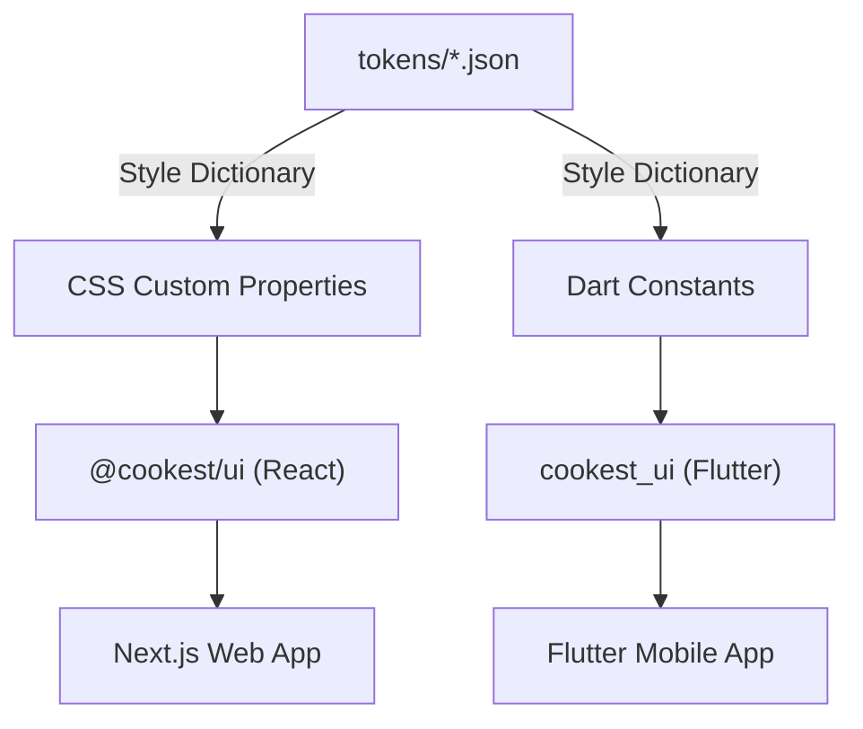

# UI Component Library Overview

The Cookest UI library provides a **unified component set** for both web (React) and mobile (Flutter), ensuring pixel-perfect visual parity across platforms. All components are built from shared design tokens defined once in JSON and generated into platform-specific formats via Style Dictionary.

## Architecture



## Packages

| Package | Platform | Path | Tech Stack |
|---------|----------|------|------------|
| `@cookest/ui` | Web | `ui-components/src/` | React 19, TailwindCSS 4, Framer Motion |
| `cookest_ui` | Mobile | `ui-components/flutter/` | Flutter 3, Material 3, Google Fonts |

## Components (12)

All components are available in both React and Flutter with matching APIs:

| Component | React | Flutter | Description |
|-----------|-------|---------|-------------|
| Button | `<Button>` | `CkButton` | Primary, secondary, ghost, danger variants with sizes and loading state |
| Input | `<Input>` | `CkInput` | Text fields with label, error, helper text, and icon support |
| Card | `<Card>` | `CkCard` | Content container with header, body, footer sub-components |
| Badge | `<Badge>` | `CkBadge` | Status indicators with dot and removable support |
| Avatar | `<Avatar>` | `CkAvatar` | User avatars with image, initials fallback, and group layout |
| Modal | `<Modal>` | `CkModal` | Dialog overlays with focus trap and animations |
| Tooltip | `<Tooltip>` | `CkTooltip` | Contextual hints with positioning |
| Toggle | `<Toggle>` | `CkToggle` | Switch controls with animated thumb |
| Select | `<Select>` | `CkSelect` | Dropdown selection with search support |
| Skeleton | `<Skeleton>` | `CkSkeleton` | Loading placeholders for text, circular, and card layouts |
| Alert | `<Alert>` | `CkAlert` | Status messages — info, success, warning, error |
| Divider | `<Divider>` | `CkDivider` | Horizontal/vertical separators with optional label |

## Design Principles

1. **Single source of truth** — Tokens are defined once in JSON and generated for each platform
2. **Visual parity** — Components look identical on web and mobile
3. **Accessibility first** — ARIA attributes (React), semantic widgets (Flutter)
4. **Dark mode built-in** — All components support light and dark themes
5. **Tree-shakeable** — Import only what you need

## Quick Start

### React

```bash
# From your React project
bun add @cookest/ui
```

```tsx
import { Button } from "@cookest/ui";
import "@cookest/ui/styles.css";

export default function App() {
  return <Button variant="primary">Get Started</Button>;
}
```

### Flutter

```yaml
# pubspec.yaml
dependencies:
  cookest_ui:
    path: ../ui-components/flutter
```

```dart
import 'package:cookest_ui/cookest_ui.dart';

MaterialApp(
  theme: CookestTheme.light,
  darkTheme: CookestTheme.dark,
  home: Scaffold(
    body: CkButton(
      onPressed: () {},
      child: Text('Get Started'),
    ),
  ),
);
```
